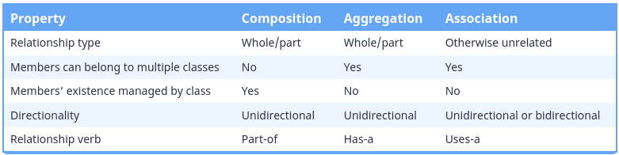
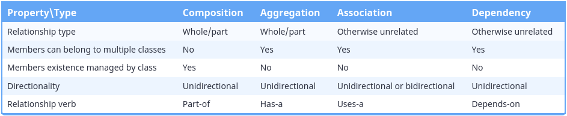
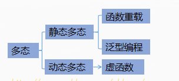
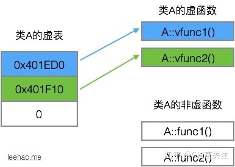
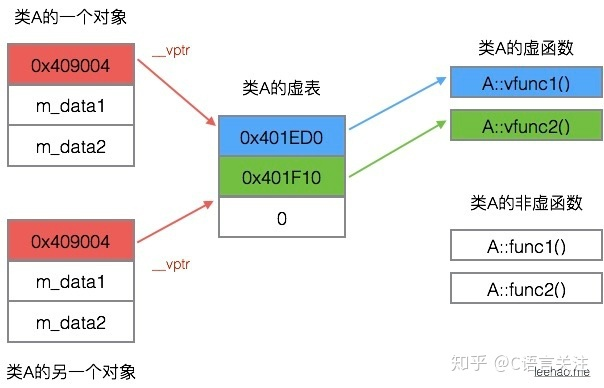

[toc]


## 一、C++语法与应用

### 1、值传递与引用传递

​	1.1 **值传递与引用传递的使用时机**
​		值传递，传递的是值的拷贝，传递以后与原来的变量就不相关了。
​		引用传递，实际上传递的原对象的地址，对引用变量操作就等于操作原对象。
​		如果只是想传递对象的信息，而不是对其进行修改，在数据量较小的情况下可以使用值传递，
​		但当数据较大(结构体/类)时，还是建议使用引用传递，而且定义为常量引用const doule &value,
​		以防对常量引用变量进行修改。

​	1.2 **临时变量、引用参数和const**
​		如果函数调用的参数不是左值或与相应的const引用参数类型不匹配，则C++将创建正确的匿名变量(临时变量)
​		，将函数调用的参数的值传递给该匿名变量，并让参数来引用该变量。其行为类似于值传递。

​	1.3 **尽可能使用const三个理由**

		- 可以避免无意中修改数据
		- 能够处理const和非const实参，否则只能接受非const数据
		- 能使函数能够正确生成并使用临时变量

### 2、C++中的包装器(Wrapper)

​	包装器，也称为适配器，这些对象用于给其他编程接口提供更一致或更合适的接口。
​	c++11中提供了多种包装器, 模板bind, mem_fn, reference_wrapper 以及function

 1. **std::function**
    一个std::function类型对象实例可包装以下可调用元素类型等。

    - [函数](#)
    - 函数指针
    - 类成员函数指针
    - 任意类型的函数对象(例:定义了operator()操作符重载的类型)

    std::function对象可被拷贝和转移，并且可以使用指定的调用特征来直接调用目标元素。
    当std::function对象未包裹任何实际的可调用元素，调用该std::function对象将抛出std::bad_function_call异常，
    所以要在调用函数对象之前，使函数对象内有可调用的元素。

    【使用】

    ```c++
    #include <iostream>
    #include <functional>
    using namespace std;
    
    int subtract(int m, int n) {
        return (m - n);
    }
    
    template <class T>
    T g_sub(T m, T n) {
        return (m - n);
    }
    
    auto g_Lambda = [](int m, int n) {
        return (m - n);
    };
    
    struct Sub {
        int operator()(int m, int n) {
            return (m - n);
        }
    };
    
    template  <class T>
    struct SubTemp {
        T operator()(T m, T n) {
            return (m - n);
        }
    };
    
    class SubOper {
      public:
        static int stSub(int m, int n) {
            return (m - n);
        }
    
        template <class T>
        static T tempStSub(T m, T n) {
            return (m - n);
        }
    
        double result(double m, double n) {
            return (m - n);
        }
    
        double constResult(double m, double n) const {
            return (m - n);
        }
    };
    
    int main()
    {
        cout << "Usage Of Function!" << endl;
        // 旧式写法
        typedef int(*pFunc)(int, int);
        pFunc oldFunc = subtract;
        cout << "Test old style::" << (*oldFunc)(0,1) << endl;
    
        // [0] 包装函数指针对象
        std::function<int(int, int)> from_pFunc = oldFunc;
        cout << "Test 0::" << from_pFunc(0,0) << endl;
    
        // [1]包装普通函数
        std::function<int(int, int)> newFunc = subtract;
        cout << "Test 1::" << newFunc(1,0) << endl;
    
        // [2]包装模板函数
        std::function<int(int, int)> tempFunc = g_sub<int>;
        cout << "Test 2::" << tempFunc(2,0) << endl;
    
        // [3]包装Lambda函数
        std::function<int(int, int)> lambdaFunc = g_Lambda;
        cout << "Test 3::" << lambdaFunc(3,0) << endl;
    
        // [4]包装仿函数
        std::function<int(int, int)> objFunc = Sub();
        cout << "Test 4::" << objFunc(4,0) << endl;
    
        // [5]包装模板函数对象
        std::function<int(int, int)> tempFuncObj = SubTemp<int>();
        cout << "Test 5::" << tempFuncObj(5,0) << endl;
    
        // [6]类静态函数
        std::function<int(int, int)> stFunc = &SubOper::stSub;
        cout << "Test 6::" << stFunc(6,0) << endl;
    
        // [7]类静态模板函数
        std::function<int(int, int)> tempStFunc = &SubOper::tempStSub<int>;
        cout << "Test 7::" << tempStFunc(7, 0) << endl;
    
        // [8]类普通函数（普通函数绑定需要依赖类对象）
        SubOper subOper;
    
        // [8.1] 使用bind，将类对象地址绑定上
        std::function<double(double, double)> resultFunc = std::bind(&SubOper::result, &subOper, placeholders::_1, placeholders::_2);
        cout << "Test 8.1::" << resultFunc(8.2, 0.1) << endl;
    
        // [8.2] 不使用bind
        std::function<double(SubOper &, double, double)> resultFunc2 = &SubOper::result;
        cout << "Test 8.2::" << resultFunc2(subOper, 8.3, 0.1) << endl;
    
        // [8.3] const
        std::function<double(SubOper &, double, double)> const_resultFunc2 = &SubOper::constResult;
        cout << "Test 8.3::" << const_resultFunc2(subOper, 8.4, 0.1) << endl;
    
        // [8.4] 常量对象
        std::function<double(const SubOper &, double, double)> const_resultFunc3 = &SubOper::constResult;
        cout << "Test 8.4::" << const_resultFunc3(subOper, 8.4, 0.1) << endl;
    
        return 0;
    }
    
    ```

    **应用**

    - 解耦

      场景1：

    


```c++
#include <iostream>
#include <functional>
#include <string>
int main()
{
    std::cout << "Usage Of Function!" << std::endl;
class TestA {
public:
    //通过暴露该接口在外部设置函数对象的具体功能
    void setDestoryHandle(std::function<bool(const std::string&)> setHandle) {
        mDestoryHandler = setHandle;
    }
    bool doDestoryByName(std::string name) {
        return mDestoryHandler(name);
    }

private:
    //定义一个函数对象成员变量
    std::function<bool(const std::string &)> mDestoryHandler;

};

class TestB {
public:
    bool destory(const std::string & name) {
        std::cout << "Test:: Call TestB destroy | name:" << name <<std::endl;
        return true;
    }
};

TestB objB;
TestA objA;

//通过调用B的成员函数设置A的函数对象功能，实现了mDestoryHandler的解耦
objA.setDestoryHandle([&](const std::string &name)->bool{
    return objB.destory(name);
});
objA.doDestoryByName("test0");

//也可以直接在lambda内直接实现其功能
objA.setDestoryHandle([&](const std::string &name)->bool{
    std::cout << "Test:: Register By User | name:" << name <<std::endl;
    return true;
});
objA.doDestoryByName("test1");

return 0;
}

/*测试结果*/
Usage Of Function!
Test:: Call TestB destroy  | name:test0
Test:: Register Cb By User | name:test1
```

场景2：
    
将数据产生与数据发送进行解耦

```c++
#include <iostream>
#include <functional>
#include <string>
#include <vector>

//Defined in media.hpp
class Media {
public:
    void sendData(std::function<void(const char* data, uint64_t dataLen)> dataFun) {
        std::vector<char> vecData('a',10);
        dataFun(vecData.data(), vecData.size());
    }
};

//Defined in network.hpp
class NetWork {
public:
    void sendByNetwork(const char* data, uint64_t dataLen){
        std::cout << "network sending..." << std::endl;
    }
};

int main()
{
    std::cout << "Usage Of Function!" << std::endl;
    Media media;
    NetWork network;

    media.sendData([&](const char* data, uint64_t dataLen){
        network.sendByNetwork(data,dataLen);
    });

    return 0;
}

/* 测试结果
 * Usage Of Function!
 * network sending...
 */
```

```
    

#### 3、类成员变量的初始化(),{},以及列表初始化

4. file_worker 开机初始化部分代码应该怎么写
```

场景3:
利用function注册实现多层级数据传递

```c++
/* media.h */
class Media {
   public:
    void sourceData(std::function<void(char* data, int len)> fun) {
        std::vector<char> msg('a', 10);
        fun(msg.data(), msg.size());
    }
};
```

```c++
/* mediaWorker.h */
#include "media.h"
class MediaWorker {
   public:
    MediaWorker(std::function<void(char* data, int len)> func)
        : mFunction(func), mThMedia([this]() { this->loop(); }) {}

    void loop() {
        while (true) {
            //1. 可以直接将mediaWorker上层的回调注册进来
            mMedia.sourceData(mFunction);

            //2. 如果要使用回调函数传递的数据，可以再包一个lambda，取出想要的数据
            mMedia.sourceData([this](char* data, int len){
                if(len > 100) {
                    //do something
                    std::cerr << "data len too long\n";
                }else{
                    mFunction(data, len);
                }
            });
        }
    }

   private:
    Media mMedia;
    std::function<void(char* data, int len)> mFunction;
    std::thread mThMedia;
};
```

```c++
#include "mediaWorker.h"
class Application {
   public:
	//将数据传递到最外层
    MediaWorker mMediaWorker{[](char * data, int len){
        //do something 
    }};
};
```

对于Media类，它通过sourceData接口产生数据。如果想将数据通过网络传递出去的话，最直白的办法就是在该接口中手写套接字通过网络发送，这样一来就将数据与网络耦合在了一起，最好将数据接口分离开来。通过function函数对象，将数据层层传递。可以用lambda对象实例化function，可以使用注册进来的function对象来实例化。


### 3、RAII

RAII（**R**esource **A**cquisition **I**s **I**nitialization）资源获取即初始化，使用局部对象来管理资源。
这里的资源指的是从系统获取，使用完需要还给系统的东西，如果使用后不释放，会导致系统资源减少。
常见的有堆内存，句柄资源，锁资源，数据库连接等。

RAII的四个过程：

​      a.设计一个类封装资源

​      b.在构造函数中初始化

​      c.在析构函数中执行销毁操作

​      d.使用时声明一个该对象的类

#### RAII的应用

- 基础封装
  先基本封装一下POSIX标准的互斥锁(https://zhuanlan.zhihu.com/p/34660259)
  再通过RAII继续封装

```c++
class MutexLock{
    public:
    	explicit MutexLock(Mutex *mu):mMutex(mu){
            this->mMutex->Lock();
        }
    	~MutexLock() { this->mMutex->Unlock();}
    private:
    Mutex *const mMutex;
    //No copy allowed
    MutexLock(const MutexLock&);
    MutexLock& operator=(const MutexLock&);
};
```

​	锁资源在类构造时获取，在析构时自动释放。

- 通过智能指针管理

  智能指针默认情况下使用delete释放它所指向的对象，我们可以重载一个智能指针中默认的删除器来自定义析构行为。

  ```c++
  class Resource {
      Resource() { /*获取资源*/ }
      ~Resource() { /*资源释放*/ }
  };
  ```

  例子: RAII封装海思音频帧对象
  音频帧的获取`` ``

2、RAII与多线程

2、智能指针返回引用与裸指针

使用RAII需要注意一下几个方面:

- **对拷贝的限制**

  Q:为什么要限制拷贝？
  A:对于一些资源的RAII类，复制行为本身是不合理的，如果对系统mutex类进行了拷贝将增加管理的风险

  ```c++
  //可以将拷贝构造函数和=重载声明为private，在类外就无法调用拷贝了
  class NoCopyResource {
    private:
    	NoCopyResource(const NoCopyResource& rhs);
      NoCopyResource& operate=(const NoCopyResource& rhs);
  };
  
  //在C++11中可以使用delete禁用
  class NoCopyResource {
    public:
    	NoCopyResource(const NoCopyResource& rhs) = delete;
      NoCopyResource& operate=(const NoCopyResource& rhs) = delete;
  };
  ```

  

- **深度拷贝，复制底层资源**
  Q:拷贝RAII合理吗？
  A:只要是需要且合理，都可以进行资源的复制。此时选择复制RAII类，是为了确保不需要该资源的副本可以被RAII正确释放。
  Q:什么情况需要深拷贝？
  A:对象中存在需要RAII类管理的资源时，基本都需要深度拷贝。因为浅拷贝会造成两个对象中都有指向同一个源的指针，如果其中一个析构时释放了资源，另一个变成为了野指针。

  ```c++
  //使用一个自定义string类做例子，资源类流程都类似
  
  //资源类
  class String{
  public:
      static String* MakeString(char* str) {
          
      }
      ~String() {
          
      }
  private:
      //无法通过构造函数来直接获取资源
      String(char* str) {};
      static char* mStr;
  };
  
  //管理类
  class StringManager {
  public:
      String* getString(char* str) {
          //RAII
          
      }
      ~StringManager() {}
      StringManager(const StringManager& rhs) {}
      StringManager& operator=(const StringManager& rhs) {}
  private:
      String* mRes;
  };
  ```


- **完整的RAII实现**

  

### 4、类型强转 - 丢弃const声明

```c++
const_cast用来丢弃变量的const声明，但不能改变变量所指向的对象的const属性。即：const_cast用于原本非const的对象；如果用于原本const的对象，结果不可预知（C++语言未对此种情况进行规定）
```

### 5、线程

thread::join()  -- 在调用join()方法的主线程A中阻塞等待join的线程B退出。线程创建后默认是可结合的(joinable)，当线程函数B自己退出或exit时，其所占用的资源不会被释放，只有调用join()返回后， B线程所占有的资源
才会被释放。
**thread::detach():** 从 thread 对象分离执行的线程，允许执行独立地持续。一旦线程退出，则释放所有分配的资源。调用 `detach` 后， *this 不再占有任何线程。
**多线程调用类方法操作同一个变量时要对该方法进行保护**
直接使用std::mutex的错误示范:

```c++
class A {
  public:
    void setSomething(std::string addr) {
       mMutex.lock();
       mSomething = addr;
       mMutex.unlock();
    }
    std::string getSomething() {
       mMutex.lock();
       return mSomething;   //直接返回了，没有释放锁，导致死锁
       mMutex.unlock();
    }
  private:
    std::string mSomething;
    std::mutex mMutex;
};
```

使用unique_lock自动管理锁的生命周期	

```c++
class A {
  public:
    void setSomething(std::string addr) {
       std::unique_lock<std::mutex> uniqueLock(mMutex);
       mSomething = addr;
    }
    std::string getSomething() {
       std::unique_lock<std::mutex> uniqueLock(mMutex);
       return mSomething;  
    }
  private:
    std::string mSomething;
    std::mutex mMutex;
};

```

### 6、完美转发

完美转发：指函数模板可以将自己的参数"完美"地转发给内部调用的其他函数。“完美”，指不仅能准确地转发参数的值，还能保证转发参数的左右值属性不变。
示例:

```c++
#include <iostream>

template <typename T>
void print(T &t) {
    std::cout << "lvalue" << std::endl;
}

template <typename T>
void print(T &&t) {
    std::cout << "rValue" << std::endl;
}

template <typename T>
void testForward(T &&v) {
    print(v);
    print(std::forward<T>(v));
    print(std::move(v));
}

int main() {
    testForward(1);
    std::cout << "==========" << std::endl;
    int x = 1;
    testForward(x);

    return 0;
}
```

输出:

```c++
lvalue
rValue
rValue
==========
lvalue
lvalue
rValue
```

分析：

传参为1时
``print(v);``传入的1虽然是右值，但是结果函数传参后分配了内存空间变成了左值。
``print(std::forward<T>(v));``使用std::forward方法，会保持其右值属性，故会调用参数为右值引用的模板函数``print(std::move(v));`` move就将传参强制转为右值。
同理传参为左值变量x时，输出如上。

**注意**

> C++11中，通常情况下右值引用形式的参数只能接收右值，不能接收左值。但对于函数模板中使用右值引用语法定义的参数来说，它不再遵守这一规定，既可以接收右值，也可以接收左值（此时的右值引用又被称为“万能引用”）。

推荐阅读:
**C++ std::move and std::forward**  http://bajamircea.github.io/coding/cpp/2016/04/07/move-forward.html

### 7、重载operator()

*参考:https://zhuanlan.zhihu.com/p/75353199*
在c++类中重载()，可以实现函数对象，该类就有类似于函数的功能。
operator()有两种常见的重载用法: Callable 和 索引
**Callable**
callable即可调用对象，包括函数指针，重载operator()的对象以及可隐式转换为两者的对象。
重载operator()的对象，也称Functor(函子)。
Functor行为类似函数,C++中的仿函数是通过在类中重载()运算符实现，使你可以像使用函数一样来创建类的对象
**1、基础使用方法**

```c++
#include <iostream>
class FuncClass{
    public:
    	void operator()(const string& str) const {
            std::cout << str << std::endl;
        }
};

int main() {
    FuncClass funClass;
    funClass("print ...");
    return 0;
}
```

**2、作为回调函数**

```c++
#include <iostream>
#include <memory>

// for_each:对于C数组中的每一个元素都进行一个处理
//在Func f 对象中做具体的处理
template <typename T, typename Func>
void for_each(T* begin, T* end, const Func& f) {
    while (begin != end) f(*begin++);
}

//打印一个变量
template <typename T>
void print(const T& x) {
    std::cout << x << " ";
}

//重载operator()的对象
template <typename T>
struct Print {
    void operator()(const T& x) const { std::cout << x << " "; }
};

int main() {
    int arr[5] = {1, 2, 3, 4, 5};

    for_each(arr, arr + 5, print<int>);

    for_each(arr, arr + 5, Print<int>());

    return 0;
}
```

也可以定义一个lambda，这个lambda函数本质上也是一个匿名Functor，C++标准中称之为闭包类型Closure。

```c++
for_each(arr, arr + 5, [](auto&& x) { std::cout << x << " "; });
```

### 8、队列

#### 	1.std::queue

​	std::queue类，实现队列的功能——FIFO，在容器尾部推入元素，从首端弹出元素。
​	实现大概如下:

```c++
template <typename T, typename Container = std::deque<T>>
class queue {
    T& front();
    void push( const T &elem );
    void pop();
    bool empty() const; // avoid undefined behaviour before calling front() 
};
```

其中，front()用来获取头部元素，而pop()使队列头部元素出列。但是为什么不在pop()出列的时候返回元素。如下:

```c++
template <typename T, typename Container = std::deque<T>>
class queue {
  T pop();  
};
```

原因有二:
1) 保证异常安全

```c++
template<class T>
class queue {
    T* elements;
    std::size_t top_position;
    // stuff here
    T pop()
    {
        auto x = elements[top_position];
        // TODO: call destructor for elements[top_position] here
        --top_position;  // alter queue state here
        return x;        // calls T(const T&) which may throw
    }
};
```

```c++
queue<Widget> q;
//....
Widget value = q.pop();
```

在执行赋值的时候，Widget的拷贝构造函数``Widget(const Widget& )``被调用，当``--top_postition``状态已改变，元素在队列内被删除，若此时发生异常，没有拷贝成功，队列顶部的元素就丢失了。如果将出队pop和返回队首元素分离开，先执行front()，将元素先拷贝，再将队首元素删除就可以避免。
2）效率低
	贴一段官方的解释:

> One might wonder why `pop()` returns `void`, instead of `value_type`. That is, why must one use `top()` and `pop()` to examine and remove the top element, instead of combining the two in a  single member function? In fact, there is a good reason for this design. If `pop()` returned the top element, it would have to return by value rather than by  reference: return by reference would create a dangling pointer. Return  by value, however, is inefficient: it involves at least one redundant  copy constructor call. Since it is impossible for `pop()` to return a value in such a way as to be both efficient and correct, it is more sensible for it to return no value at all and to require clients  to use `top()` to inspect the value at the top of the stack

​	意思是，如果返回值，就会创建一个没人使用的副本，而且在接受该值时Widget value必然发生一次实例化。返回引	用则会产生一个空悬指针。

#### 2. 实现ThreadQueue阻塞队列

该阻塞队列将有以下几点要求:

- 可以支持多生产者多消费者并发访问	
- 队列为空时，元素出列会被阻塞
- 元素出列时保证异常安全性

```c++
#ifndef BLOCKQUEUE_H
#define BLOCKQUEUE_H

#include <condition_variable>
#include <mutex>
#include <queue>
#include <utility>

template <typename T>
class BlockQueue {
   public:
    T pop() {
        std::unique_lock<std::mutex> lock(mMutex);
        mCondition.wait(lock, [this]() { return !mQueue.empty(); });
        auto value = std::move(mQueue.front());
        mQueue.pop();
        return value;
    }

    void pop(T& item) {
        std::unique_lock<std::mutex> lock(mMutex);
        mCondition.wait(lock, [this]() { return !mQueue.empty(); });
        item = std::move(mQueue.front());
        mQueue.pop();
    }

    bool tryPop(T& item) {
        std::unique_lock<std::mutex> lock(mMutex);
        if (mQueue.empty()) {
            return false;
        }
        item = std::move(mQueue.front());
        mQueue.pop();
        return true;
    }
	//empty,size should not modify the queue, so const
    bool empty() const noexcept {
        std::unique_lock<std::mutex> lock(mMutex);
        return mQueue.empty();
    }

    size_t size() const noexcept {
        std::unique_lock<std::mutex> lock(mMutex);
        return mQueue.size();
    }

    void push(const T& item) {
        std::unique_lock<std::mutex> lock(mMutex);
        mQueue.push(item);
        lock.unlock();  // unlock before notificiation to minimize mutex
                        // contention
        mCondition.notify_one();  // notify one waiting thread
    }

    void push(T&& item) {
        std::unique_lock<std::mutex> lock(mMutex);
        mQueue.push(std::move(item));
        lock.unlock();
        mCondition.notify_one();
    }

    BlockQueue() = default;
    BlockQueue(const BlockQueue&) = delete;             //disable copying
    BlockQueue& operator=(const BlockQueue&) = delete;  //disable assignment
   private:
    std::queue<T> mQueue;
    std::mutex mMutex;
    std::condition_variable mCondition;
};

#endif
```

1. pop()从队列取出元素时，先给互斥量上锁，然后条件变量wait检测是否满足谓词条件``！mQueue.empty()`` ,满足的话即队列不为空，则取出数据，否则暂时释放锁，阻塞线程，直到条件满足才会被唤醒。

2. push()向队列填入数据，push完之后会主动唤醒阻塞的pop()操作。

3. empty，size成员函数都不会修改queue，所以将其声明为const常成员函数，表明不会修改成员变量，使其函数意义更清晰，增加可读性。

4. 在``push()``的唤醒操作前会主动释放锁，是为了最小化互斥量的争用。在``pop()``中锁的释放由``wait()``和``unique_lock``的生命周期决定。

5. 对于上面的同步队列类还有很多扩展的地方，比如pop()可以增加超时机制，可以队列限制队列的大小，超过大小时阻塞``push()``操作。

6. ``push()``方法重载了左值引用与右值两个版本，以适应传入的左值与右值，不使用值传递是为了避免无效的拷贝。
   当然，还可以使用函数模板与完美转发来代替两次重载。

   ```c++
       template <typename Message>
       void push(Message&& mesg) {
           std::unique_lock<std::mutex> lock(mMutex);
           mQueue.push(std::forward<Message>(mesg));
           lock.unlock();
           mCondition.notify_one();
       }
   ```

   

多生产者消费者场景

   ```c++
#include <chrono>
#include <iostream>
#include <mutex>
#include <string>
#include <thread>

#include "blockQueue.h"

BlockQueue<std::string> queue;
std::mutex printMutex;

void producer(int productNum, int waitMilliseconds) {
    for (int i = 0; i < productNum; ++i) {
        std::string message{"Message-"};
        message.append(std::to_string(i));
        queue.push(message);
        std::cout << "push data" << message << std::endl;
        std::this_thread::sleep_for(
            std::chrono::milliseconds(waitMilliseconds));
    }
    std::lock_guard<std::mutex> lock(printMutex);
    std::cout << "producer push message ok!\n";
}

void consumer(int consumerID) {
    while (true) {
        std::string message;
        queue.pop(message);
        {
            std::lock_guard<std::mutex> lock(printMutex);
            std::cout << "consumer-" << consumerID << " receive:" << message
                      << std::endl;
        }
    }
}

int main() {
    std::thread thProducer1{producer, 10, 1};
    std::thread thProducer2{producer, 10, 1};
    std::thread thConsumer1{consumer, 1};
    std::thread thConsumer2{consumer, 2};

    thProducer1.join();
    thProducer2.join();
    thConsumer1.join();
    thConsumer2.join();

    return 0;
}
   ```


> 参考:
>
> 1. http://senlinzhan.github.io/2015/08/24/C-%E5%AE%9E%E7%8E%B0%E9%98%BB%E5%A1%9E%E9%98%9F%E5%88%97/
> 2. https://juanchopanzacpp.wordpress.com/2013/02/26/concurrent-queue-c11/

​	

###    9、条件变量

​	在C++11中，可以使用条件变量实现多个线程间的同步操作。
条件变量是利用线程间共享的全局变量进行同步的一种机制，主要有两个动作:

- 一个线程因等待“条件变量的条件成立"而挂起 (wait / wait_for / wait_until)
- 另一个线程使"条件成立"，给出信号，从而唤醒被等待的线程

条件变量一般和一个互斥量同时使用，使用时需要先给互斥量上锁，然后条件变量检测是否满足条件，如果不满足条件就暂时释放锁，然后阻塞线程，直到条件满足，线程才会被唤醒。一般使用互斥锁std::mutex，且使用std::unique_lock管理锁。

#### 1. **成员函数说明**

1) wait()成员函数

```c++
void wait(std::unique<std::mutex>& lock);
//Predicate 谓词函数，可以是普通函数或是lambda表达式
template<class Predicate>
void wait(std::unique<std::mutex>& lock, Predicate pred);
```

以上两种都是被``notify_one()``或 ``notify_broadcast()``唤醒，但是第二种方式先得满足Predicate的条件，再wait，否则继续解锁互斥量，使线程处于阻塞或等待。等价于:

```c++
while(!Pred()) {
    wait(lock);
}
```

2）wait_for() 成员函数

```c++
template< class Rep, class Period >
std::cv_status wait_for( std::unique_lock<std::mutex>& lock,
                         const std::chrono::duration<Rep, Period>& rel_time);
                         
template< class Rep, class Period, class Predicate >
bool wait_for( std::unique_lock<std::mutex>& lock,
               const std::chrono::duration<Rep, Period>& rel_time,
               Predicate pred);
```

wait_for 导致当前线程阻塞直至条件变量被**通知**，或**虚假唤醒发生**，或者**超时返回**。
返回值说明：
		若经过 rel_time 所指定的关联时限则为 std::cv_status::timeout ，否则为 std::cv_status::no_timeout 。
		若经过 rel_time 时限后谓词 pred 仍求值为 false 则为 false ，否则为 true 。
以上两个wait函数都会在阻塞时调用unique_lock的unlock()自动释放锁，以便其他线程有机会获得锁。

3) notify_all / notify_one

```c++
void notify_one() noexcept;
若任何线程在 *this 上等待，则调用 notify_one 会解阻塞(唤醒)等待线程之一
void notify_all() noexcept;
若任何线程在 *this 上等待，则解阻塞（唤醒)全部等待线程
```

#### 2.**虚假唤醒 **

> 用于多线程竞争条件下，具体含义去参考官方文档。我说一下形象的意思就是你妈同时通知你爸和你去做饭，做饭只需要一个人做即可， 当你去准备做饭时，你爸已经在做饭了，所以你就相当于被虚假唤醒了。

在正常情况下，wait类型函数返回有两种情况: 唤醒返回，超时返回
实际情况下，因为操作系统的原因，wait类型在不满足条件时也会返回，导致虚假唤醒，因此一般都是用带谓词的wait函数，wait(xxx, Predicate pred);

```c++
while(!Pred()) {
    wait(lock);
}
```

若不存在虚假唤醒，代码如下:

```c++
if(不满足xxx条件){
    //没有虚假唤醒，wait函数可以一直等待，直到被唤醒或者超时，没有问题。
    //但实际中却存在虚假唤醒，导致假设不成立，wait不会继续等待，跳出if语句，
    //提前执行其他代码，流程异常
    wait();   
}
//其他代码
...
```

正确使用方式·，使用while语句解决:

```c++
while (!(xxx条件)) {
    //虚假唤醒发生，由于while循环，再次检查条件是否满足，
    //否则继续等待，解决虚假唤醒
    wait();  
}
//其他代码
....
```

#### 3.使用条件变量

使用条件变量解决生产者消费者问题，问题描述如下:
生产者生成一定量的数据放到缓冲区，重复此过程。同时消费者也在缓冲区消耗这些数据。
问题关键: 要保证生产者不会在缓存区满时加入数据，消费者也不会缓冲区空时消耗数据。
所以必须让生产者在缓冲区满时休眠，等到下次消费者消耗缓冲区数据的时候，生产者才能被唤醒，开始向缓冲区添加数据。也可以让消费者在缓冲区空时进入休眠，等到生产者向缓冲区添加数据后，再唤醒消费者。

```c++
#include <unistd.h>

#include <chrono>
#include <condition_variable>
#include <deque>
#include <iostream>
#include <mutex>
#include <thread>

std::mutex mutex;
std::condition_variable cv;

// buffer
std::deque<int> dataDeque;
const int maxNum = 30;
int nextIndex = 0;

const int producerThreadNum = 3;
const int consumerThreadNum = 3;

void producerThread(int threadId) {
    while (true) {
        std::this_thread::sleep_for(std::chrono::milliseconds(500));
        //加锁
        std::unique_lock<std::mutex> uniqueLock(mutex);
        //当队列未满时，继续添加数据
        cv.wait(uniqueLock, []() { return dataDeque.size() <= maxNum; });
        nextIndex++;
        dataDeque.push_back(nextIndex);
        std::cout << "producer thread: " << threadId << "  data: " << nextIndex;
        std::cout << "  queue size: " << dataDeque.size() << std::endl;

        //向缓冲区放入数据后，唤醒消费者
        cv.notify_all();
        //自动释放锁
    }
}

void consumerThread(int threadId) {
    while (true) {
        std::this_thread::sleep_for(std::chrono::milliseconds(550));
        //加锁
        std::unique_lock<std::mutex> uniqueLock(mutex);
        //当队列非空时，取走数据
        cv.wait(uniqueLock, []() { return !dataDeque.empty(); });
        nextIndex--;
        int data = dataDeque.front();
        dataDeque.pop_front();
        std::cout << "consumer thread: " << threadId << "  data: " << nextIndex;
        std::cout << "  queue size: " << dataDeque.size() << std::endl;

        //消费者从缓冲区取走数据后唤醒生产者
        cv.notify_all();
        //自动释放锁
    }
}

int main() {
    std::thread arrProducerThread[producerThreadNum];
    std::thread arrConsumerThread[consumerThreadNum];

    for (int i = 0; i < producerThreadNum; i++) {
        arrProducerThread[i] = std::thread(producerThread, i);
    }
    for (int i = 0; i < consumerThreadNum; i++) {
        arrConsumerThread[i] = std::thread(consumerThread, i);
    }
    for (int i = 0; i < producerThreadNum; i++) {
        arrProducerThread[i].join();
    }
    for (int i = 0; i < consumerThreadNum; i++) {
        arrConsumerThread[i].join();
    }
    return 0;
}
//reference:https://blog.csdn.net/c_base_jin/article/details/89741247
```


### 9、海思程序框架

有以下几个对象:

```c++
1.MediaWorker  
//负责系统及子模块初始化，并产生音视频帧数据,通过接口发送音频、视频的裸流到不同模块
2.Publisher
//通过发布-订阅模式实现网络发送接口，将接口以回调的形式注册到各个模块实现数据发送
//发送数据有:音视频裸流、Ts流、系统信息、文件状态、Ts状态、Rtmp状态
3.FileWorker
//实现接受Ts保存为Mp4文件的功能，并监测上报文件保存状态
4.TsWorker
//该模块接收MediaWorker产生的裸流，生成Ts流发送给订阅者及FileWorker,且将转Ts的错误信息发布给订阅者
5.RtmpWorker
//接受MediaWorker产生的裸流，在内部发送给Rtmp的URL,且发布Rtmp推流过程中的错误信息给订阅者
6.SystemInfoCollector
//系统信息收集器，主要定时收集电量、内存、编码属性、ISP等信息，并发布给订阅者
7.MessageController
//通过请求-应答模式，接受指令，控制各个模块的行为
8.FdkaacEncoder
//第三方的aac编码库，对MediaWorker的音频裸流进行多声道编码
```

框架如下:

.png)


###  end 

### 10、写文件相关的若干问题

现在有一个需求：每秒钟向文件中写入一个整型数，每次递增1，且要覆盖之前的数。
初步的代码如下:

```c++
int main() {
    std::ofstream file;
    file.open("test.dat", std::ios::binary);
    if (!file.is_open()) {
        std::cout << "open file failed!\n";
        return -1;
    }
    int count = 0;
    while (true) {
        file.write((char*)&count, sizeof(int));
        file.flush();
        count++;
        sleep(1);
    }
    file.close();
    return 0;
}
```

运行后cat一下，文件里似乎没有写入任何东西。
改进了一下代码:
版本一:

```c++
int main() {
    std::ofstream file;
    file.open("test.dat",std::ios::binary);
	if(!file.is_open()) {
        std::cout << "open file failed!\n";
		return -1;
    }
    int count = 0;
	while(true) {
        file.seekp(std::ios::beg);  //write in the begin
		file << count;
		file.flush();
		count++;
		sleep(1);
    }
    file.close();
    return 0;
}
```

版本二:

```c++
int main() {
    std::ofstream file;
    file.open("test.dat",std::ios::binary);
	if(!file.is_open()) {
        std::cout << "open file failed!\n";
		return -1;
    }
    int count = 0;
	while(true) {
        std::string strNum = std::to_string(count);
        file.seekp(std::ios::beg);  //write in the begin
        file.write(strNum.c_str(), strNum.size());
		file.flush();
		count++;
		sleep(1);
    }
    file.close();
    return 0;
}
```

在最开始的错误代码运行后的test.dat文件里并非没有东西，使用vscode的Hex Editor打开可以看到


文件中写入的依次的count的二进制值，在文件打开显示的时候，会按照二进制值对应的ASCII码的字符进行显示。比如count = 48 时，二进制值为00110000，以十六进制打开就是对应的30, 十进制对应的是48, 按照ASCII表，对应的字符是0，后面的依次类推。ASCII表如下:


在版本一与版本二中，">>"和“to_string”都对count进行了格式化，就如何printf一样格式化输出，格式化后写入文件的就是原内容的ASCII值，这样打开文件，就可以直接显示原来的内容。比如count=0，格式化后实现写入文件的是48(00110000)。
如何在每次写入时覆盖掉之前的内容，可以使用std::fstream::feekp(), 重新定位文件指针。
std::ios::beg, std::ios::end;

### 11、实例化对象时使用()、{}的区别

### 12、代码注释规范

```c++
/**
 * @brief  @param  @return @author @date @version是代码书写的一种规范
 * @brief  ：简介，简单介绍函数作用
 * @param  ：介绍函数参数
 * @return：函数返回类型说明
 * @exception NSException 可能抛出的异常.
 * @author zhangsan：  作者
 * @date 2011-07-27 22:30:00 ：时间
 * @version 1.0 ：版本  
 * @property ：属性介绍
 * */
```


## 二、C++核心准则

- 坚持使用const（检查成员函数是否修改对象；检查函数是否修改通过指针或引用传递的参数）[P.1]()

- 编译时检查优于执行时检查，无法在编译时检查的，应可以在执行时检查 [P.5-6]()

- 使用标准库优化，封装**混乱**、**低层次**、**冗长**的代码(如涉及 复杂指针、自己管理生命周期、类型转换等) [P.11]()

- 避免非常量的全局变量

  > 如果想使用全局数据(命名空间)


## 三、LearnCpp

### x.x 引用

#### **概念**

**引用并非对象，相反，它只是为一个已经存在的对象所起的别名**
通常情况，我们说引用指的是左值引用。引用理解为给对象起了一个别名，写成取地址符&加上变量名。
``int val = 1;   int & refVal = val;``
在初始化变量的时候，初始值会被拷贝到新建的对象中，然而在定义引用的时候，程序将引用变量和它的初始值绑定到一起，而不是将初始值拷贝给引用。一旦引用初始化完成，引用就将和它的初始值对象一直绑定在一起，并无法绑定到另一个对象，所以引用必须初始化。
看一段代码:

```c++
#include <iostream>
using namespace std;
int main() {
	int a = 10;
	int &b = a;

	cout << "a的地址为：" << &a << endl;
	cout << "b的地址为：" << &b << endl;
	return 0;
}
```

运行后打印出的地址是一样的，是否意味着引用变量b本身不占内存空间。非也，实际上对b取地址得到的是a的地址，原因是引用在c++中是通过常指针实现的: ``int &b = a;`` 等价于 ``int* const b = &a;``  在对b取地址时编译器会把``&b``编译为``&(*b)``,所以打印出的是a的地址。所以引用跟指针一样，在32位系统中占4字节，64位8字节。
引用b是一个常指针，指针本身即指向的地址不可以改变，但是该地址的内容可以改变，所以说一旦引用初始化就不可以和绑定的对象分离了。
由此可以总结一下引用和指针的区别:

- **安全**：引用一旦和对象绑定，就不能更换对象，安全性好；但是指针指向的对象时可以改变的，不能保证安全；
- **方便**：引用实际上是封装好的指针解引用，可以直接使用；但指针还得手动解引用，不方便；
- **级数**：引用只有一级，不能多次引用；但是指针的级数没有限制；
- **初始化**：引用必须被初始化为一个已有对象的引用(合法的内存)，而指针可以初始化为nullptr；

#### **为什么引入引用**

经过上面的分析，我们知道引用是指向对象的常指针，使用引用的好处是，我们在使用引用的时候不会在内存中生成对象的副本。

#### **应用:**

**1 - 传参**
将引用用于函数参数传递中，解决大块数据或对象在值传递时效率不高的问题。虽然传递指针和传递引用效果一样，但是引用传递更可读，清晰，不易产生错误。
**2 - 常引用**
当我们不想传递的数据被改变时，可以通过const加引用，提高引用传递的安全性。
**3 - 引用作为返回值**
将引用作为返回值，可以避免在内存中产生返回值的副本。
使用引用作为返回值，要注意以下几点:
    (1) 不能返回局部变量的引用
    (2) 不能返回函数内部new分配的内存的引用
    (3) [**c++**中有些重载**运算符**为什么要**返回引用** ](https://www.cnblogs.com/codingmengmeng/p/5871254.html)
    (4) 引用和多态

> 参考:https://www.cnblogs.com/xiaofengkang/archive/2011/05/16/2048262.html


###  x.1 左值引用与右值引用


## 12 面向对象编程基础

### 12.1 


### 16.6 容器类

生活中，容器随处可见，主要的作用有两个:组织和储存。
同理，容器类是用于保存和组织另外一种类型的类。c++中有很多容器类，vector，map，queue等。
比较常用的就是vector数组类，相比于内置类型的数组，数组容器类在增删元素时能动态调整大小，在传递给函数时记住它们的大小，并进行边界检查。  这使得数组容器类比普通数组更方便，安全。
我们看一下一个定义良好的容器类具有哪些功能:

- 可以通过构造函数创建一个空容器
- 能在容器中插入或移除对象
- 能知道当前容器中的对象数量
- 能清空容器中的所有对象
- 能对容器中的对象进行访问
- 能对元素进行排序(可选)

有时，有的容器会忽略部分功能，例如数组类会忽略掉操作比较慢的插入删除操作。

#### 容器的类型

容器类通常有两种不同的种类。  
**值容器**是存储它们所持有的对象副本的组合（因此负责创建和销毁这些副本）。  ？？？
**引用容器**是存储指向其他对象的指针或引用的聚合（因此不负责创建或销毁这些对象） ？？？

通常，容器只保存一种类型的数据，整型数组就只能存放整型数据。如果同时想在一个容器保存多种类型数据，可以借助模板来实现。

#### 实现一个数组容器类

以上面的功能作参考，从头实现一个整型数组类。这个容器类会是一个值容器，保存元素的副本。类似于``std::vector<int>``。
首先创建头文件

```c++
#ifndef INTARRAY_H
#define INTARRAY_H
 
class IntArray{
};
 
#endif
```

## 16 对象关系

### 16.1 对象关系

part-of 
has-a  
depends-on
member-of

### 16.2 组合 Composition

在生活中，较大的物件都是有更小的东西组成的。我们叫这个为对象组合。
对象组合模型在对象之间有"has a"的关系。比如 Your computer has a CPU.
对象组合有两种基本的类型:组合和聚合

#### 组合 

要成为组合，对象和part要满足一下关系:

- 部分（成员）是对象（类）的一部分     
- 部件（成员）一次只能属于一个对象（类）    
-  部分（成员）的存在由对象（类）管理     
- 部分（成员）不知道对象（类）的存在

组合关系是部分-整体关系，其中**部分必须构成整个对象的一部分**。  例如，心脏是人身体的一部分。  组合中的部分只能是一个对象的一部分。  一颗属于一个人身体的心脏不能同时成为其他人身体的一部分。
在组合关系中，**对象负责部件的存在**。  大多数情况下，这意味着在创建对象时创建部件，并在销毁对象时销毁部件。
**部分不知道整体的存在**。你的心脏幸福地运转着，却没有意识到它是更大结构的一部分。  我们称之为**单向关系**，因为身体知道心脏，但相反心脏不知道有身体的存在。  
请注意，**组合与部件的可转移性无关**。  心脏可以从一个身体移植到另一个身体。  但是，即使移植后，它仍然满足组成的要求（心脏现在归接受者所有，除非再次转移，否则只能是接受者对象的一部分）。
下面来看一个无处不在的例子: Fraction 分数类

```c++
class Fraction
{
private:
	int m_numerator;
	int m_denominator;
public:
	Fraction(int numerator=0, int denominator=1)
		: m_numerator{ numerator }, m_denominator{ denominator } {
		// We put reduce() in the constructor to ensure any fractions we make get reduced!
		// Since all of the overloaded operators create new Fractions, we can guarantee this will get called here
		reduce();
	}
};
```

这个类有两个数据成员：分子和分母。  分子和分母是分数的一部分（包含在分数中）。  它们一次不能属于多个分数。   分子和分母不知道它们是分数的一部分，它们只是保存整数。  创建 Fraction 实例时，将创建分子和分母。   当分数实例被销毁时，分子和分母也被销毁。

组合是在 C++ 中最容易实现的关系类型之一。  它们通常被创建为具有普通数据成员的结构或类，它们的生命周期与类实例本身的生命周期绑定。  需要进行动态分配或解除分配的组合可以使用指针数据成员来实现。  在这种情况下，组合类应该负责自己（而不是类的用户）进行所有必要的内存管理。  一般来说，如果你可以使用组合来设计一个类，那么你应该使用组合来设计一个类。  使用组合设计的类直接、灵活且健壮

在组合模式下使用子类的好处:

- 每个单独的类都可以保持简单明了，专注与自己的任务。
- 使得子类可以重用
- 父类可以让子类完成大部分繁重的工作，而专注于协调子类间的数据流。

### 16.3 聚合 Aggregation

要符合聚合条件，整个对象及其部分必须具有以下关系： 

- 部分（成员）是对象（类）的一部分
- 部件（成员）一次可以属于多个对象（类)
- 部分（成员）不由对象（类）管理 
- 部分（成员）不知道对象（类）的存在

与组合一样，聚合仍然是部分-整体的关系，部分包含在整体中，并且是单向关系。  但是，与组合不同的是，部件一次可以属于多个对象，并且整个对象不对部件的存在和寿命负责。  创建聚合时，聚合不负责创建部件。  当聚合被销毁时，聚合不负责销毁部分。
例如：考虑个人与家庭地址的关系，每个人都会有一个地址，但是该地址可以同时属于多个人，如家庭成员或者室友。这个地址可能在此人来之前就存在，且在此人离开后依然存在。一个人可以知道自己住在哪个地址，地址却不知道人们住在哪里。这就是一种聚合关系。

#### 实现聚合

在组合中，我们通常使用普通成员变量(或动态分配后的指针)来将我们的部分添加到组合中。
在聚合中，我们依然将部分添加为成员变量，但是该成员变量通常是个引用或指针，指向类范围外创建的对象。所以聚合要么将指向的对象作为构造函数参数，要么从空part开始，然后通过访问函数或运算符来添加part子对象。
聚合下的part存在与类范围之外，当聚合类被销毁，指针或引用被销毁但part本身还存在。
示例: 老师与部门，简化下一个部门仅能容纳一名教师，且老师将不知道会入职哪个部门。

```c++
#include <iostream>
#include <string>

class Teacher{
private:
  std::string m_name{};
public:
  Teacher(const std::string& name)
      : m_name{ name } {}
  const std::string& getName() const { return m_name; }
};

class Department{
private:
  const Teacher& m_teacher; // This dept holds only one teacher for simplicity, but it could hold many teachers

public:
  Department(const Teacher& teacher)
      : m_teacher{ teacher } {}
};

int main()
{
  // Create a teacher outside the scope of the Department
  Teacher bob{ "Bob" }; // create a teacher
  
  { // Create a department and use the constructor parameter to pass
    // the teacher to it.
    Department department{ bob };
  } // department goes out of scope here and is destroyed
  // bob still exists here, but the department doesn't
  std::cout << bob.getName() << " still exists!\n";
  return 0;
}
```

在这个例子里面，Bob老师在部门外独立创建的，然后通过部门的构造函数传递进部门。当部门解散后，教师的部门信息(引用)也销毁了，但是老师本人没有销毁，直到main结束。part 的生命周期不由聚合类来掌控。

#### 组合和聚合总结

**组合**：通常使用普通成员变量 ，如果类自己处理对象分配/释放，则可以使用指针成员 ，负责零件的创建/销毁
**聚合**：通常使用指向或引用成员，部件在于聚合类范围之外创建，不负责创建/销毁零件

组合和聚合可以在同一个类中实现，例如，一个部门可以有一个总部门名字和一些技术小组，并通过组合添加到部门，并和部门一起创建或销毁。另一方面，老师将通过聚合的方式添加到部门，并独立创建销毁。
使用聚合时，要注意外部不在有指向部件的指针或引用，或忘记清理，则会导致内存泄露。

### std::reference_wrapper

在上面的 Department/Teacher 示例中，我们在 Department 中使用了一个引用来存储教师。   如果只有一个老师，这很好用，但是如果一个部门有多个老师怎么办？  我们想将这些教师存储在某种列表（例如  std::vector）中，但固定数组和各种标准库列表不能保存引用（因为列表元素必须是可分配的，而引用不是对象，不能重新分配)。
``std::vector<const Teacher&> m_teachers{}; // Illegal``
我们可以使用指针代替引用，但这会打开存储或传递空指针的可能性。  在 Department/Teacher 示例中，我们不想允许空指针。  为了解决这个问题，有 std::reference_wrapper。  本质上，std::reference_wrapper 是一个类似于引用的类，但也允许赋值和复制，因此它与 std::vector 等列表兼容。
（1）使用std::reference_wrapper 需要包含<functional>头文件
（2）当您创建 std::reference_wrapper 包装对象时，该对象不能是匿名对象
       （因为匿名对象具有表达式范围，这会使引用悬空）。 
（3） 当您想将对象从 std::reference_wrapper 中取出时，可以使用 get() 成员函数。

```c++
#include <functional> // std::reference_wrapper
#include <iostream>
#include <vector>
#include <string>

int main(){
  std::string tom{ "Tom" };
  std::string berta{ "Berta" };
    
  // these strings are stored by reference, not value
  std::vector<std::reference_wrapper<std::string>> names{ tom, berta }; 

  std::string jim{ "Jim" };
  names.push_back(jim);

  for (auto name : names) {
    // Use the get() member function to get the referenced string.
    name.get() += " Beam";
  }
  std::cout << jim << '\n'; // Jim Beam
  return 0;
}
```

### 16.4 关联 Association

在前面的讲解中，我们知道，对象组合用于关系建模，其中复杂的对象将由一个或多个相似的对象构成。
在本课中，我们将研究两个原本不相关的对象之间的一种较弱的关系类型，称为关联。

#### 关联

关联关系，有以下的描述:

- 关联的对象(成员)与对象(类)没有包含从属的关系。
- 关联的对象(成员)可以同时属于多个对象(类)
- 关联对象（成员）的存在不受对象（类）管理
- 关联对象（成员）可能知道也可能不知道对象（类）的存在
  即，关联关系可以是单向的也可以是双向的。

举个栗子，就比如医生和患者的关系，医生虽然和患者有关系，但不是部分与整体(对象组合)的关系。一个医生一天可以看很多病人，一个病人也可以看很多医生。两者的生命周期互不相关。
我们可以称关联模型为**user-a**关系。医生"使用"患者(以赚取收入)，患者"使用"医生(以获取健康)

#### 实现关联

关联是一种广泛的关系，它们可通过多种不同的方式实现。  **大多数情况下，关联是使用指针实现的**。
在这个例子中，我们将实现双向的医生/患者关系，因为医生知道他们的患者是谁是有意义的，反之亦然。

```c++
#include <functional>
#include <iostream>
#include <string>
#include <vector>

class Patient; 

class Doctor{
    public:
    Doctor(const std::string& name):m_name{name} {}

    void addPatient(Patient& patient);

    friend std::ostream& operator<<(std::ostream& out, const Doctor& doctor);

    const std::string& getName() const { return m_name; }

    private:
    std::string m_name{};
    std::vector<std::reference_wrapper<const Patient>> m_patient{};
};

class Patient{
    public:
    Patient(const std::string& name):m_name{name} {}

    void addDoctor(Doctor& doctor) {
        m_doctor.push_back(doctor);
    }

    // We'll implement this function below Doctor since we need Doctor to be defined at that point
	friend std::ostream& operator<<(std::ostream& out, const Patient& patient);

	const std::string& getName() const { return m_name; }

    // We'll friend Doctor::addPatient() so it can access the private function Patient::addDoctor()
	friend void Doctor::addPatient(Patient& patient);

    private:
    std::string m_name{};
    std::vector<std::reference_wrapper<const Doctor>> m_doctor{};
};

void Doctor::addPatient(Patient& patient){
	// Our doctor will add this patient
	m_patient.push_back(patient);

	// and the patient will also add this doctor
	patient.addDoctor(*this);
}

std::ostream& operator<<(std::ostream& out, const Doctor& doctor){
	if (doctor.m_patient.empty()){
		out << doctor.m_name << " has no patients right now";
		return out;
	}

	out << doctor.m_name << " is seeing patients: ";
	for (const auto& patient : doctor.m_patient)
		out << patient.get().getName() << ' ';

	return out;
}

std::ostream& operator<<(std::ostream& out, const Patient& patient){
	if (patient.m_doctor.empty()){
		out << patient.getName() << " has no doctors right now";
		return out;
	}

	out << patient.m_name << " is seeing doctors: ";
	for (const auto& doctor : patient.m_doctor)
		out << doctor.get().getName() << ' ';

	return out;
}

int main(){
	// Create a Patient outside the scope of the Doctor
	Patient dave{ "Dave" };
	Patient frank{ "Frank" };
	Patient betsy{ "Betsy" };

	Doctor james{ "James" };
	Doctor scott{ "Scott" };

	james.addPatient(dave);

	scott.addPatient(dave);
	scott.addPatient(betsy);

	std::cout << james << '\n';
	std::cout << scott << '\n';
	std::cout << dave << '\n';
	std::cout << frank << '\n';
	std::cout << betsy << '\n';

	return 0;
}

//类的友元函数是定义在类外部，但是有权访问类内私有成员和保护成员。
//重载operator<<，返回引用为了连续运算；cout << jame --> operator(cout, jame)
```


一般来说，如果能使用单向关联，最好避免使用双向关联。

#### 小结



### 16.5 依赖 Dependencies

当一个对象调用另一个对象的功能来完成某些任务时，就会产生依赖关系。这是一种比依赖还弱的关系。但是对依赖对象的任何修改都会破坏依赖调用者的功能。依赖始终是单向关系。
最常用的``std::cout``就是使用依赖的例子，我们使用 std::cout 的类使用它来完成将某些内容打印到控制台的任务。
示例:

```c++
#include <iostream>

class Point {
private:
    double m_x, m_y, m_z;
public:
    Point(double x=0.0, double y=0.0, double z=0.0): m_x(x), m_y(y), m_z(z) {}
    friend std::ostream& operator<< (std::ostream &out, const Point &point);
};

std::ostream& operator<< (std::ostream &out, const Point &point){
    // Since operator<< is a friend of the Point class, we can access Point's members directly.
    out << "Point(" << point.m_x << ", " << point.m_y << ", " << point.m_z << ")";
    return out;
}

int main() {
    Point point1(2.0, 3.0, 4.0);
    std::cout << point1;
    return 0;
}
```

在上面的代码中，``Point`` 与 ``std::cout`` 没有直接关系，但它依赖于 ``std::cout``，因为 ``operator<<`` 使用 ``std::cout`` 将 ``Point ``打印到控制台。

#### 关联和依赖的区别

代码层面的最主要区别在于: 依赖以调用某个类的成员函数或运算符操作，而关联的关系建立在类属性的基础上。

### 16.X 小结




## 17  继承

### 17.1 继承简介

在上一章我们讨论了对象组合，其中复杂的类由更简单的类和类型构成。而对象组合只是C++中允许我们构造复杂类的两种方法之一。另一种就是继承，为两个对象之间的"``is-a``"关系建模。
与对象组合不同，它涉及通过组合和连接其他对象来创建新对象，继承涉及通过直接获取其他对象的属性和行为，然后对其进行扩展或专门化来创建新对象。  

在本章中，我们将探索继承在 C++ 中如何工作的基础知识。


### 17.2 继承基础

### 17.3 派生类构造的顺序

上代码：

```c++
class Base{
public:
    int m_id {};
    Base(int id=0)
        : m_id(id) {}

    int getId() const { return m_id; }
};

class Derived: public Base {
public:
    double m_cost {};
    Derived(double cost=0.0)
        : m_cost(cost) {}

    double getCost() const { return m_cost; }
};
```

在这个例子中派生类Derived继承了基类Base，我们可能会想Derived 拷贝了Base的成员到自己那儿。然而，事实并非如此。  相反，我们可以将 Derived 视为由两部分组成的类：一部分 Derived 和一部分 Base。

```c++
int main() {
    Base base;
    return 0;
}
```

对于非派生类，如Base，它的初始化是通过调用默认构造函数完成的。
下面看一下派生类Derived的初始化

```c++
int main() {
    Derived derived;
    return 0;
}
```

派生实际上是两部分：基础部分和派生部分。  
当 C++ 构造派生对象时，它是分阶段进行的。  首先，最基类（在继承树的顶部）首先被构造。  然后依次构造每个子类，直到最后构造最子类（在继承树的底部）。

### 17.4  派生类的构造与初始化

看到之前的例子:

```c++
class Base {
public:
    int m_id {};
    Base(int id=0)
        : m_id{ id } {}

    int getId() const { return m_id; }
};

class Derived: public Base{
public:
    double m_cost {};
    Derived(double cost=0.0)
        : m_cost{ cost } {}

    double getCost() const { return m_cost; }
};
```

对于非派生类，构造函数只需担心自己的成员。  例如，考虑 Base。  我们可以像这样创建一个 Base 对象:

```c++
int main() {
    Base base{ 5 }; // use Base(int) constructor
    return 0;
}
```

下面是实例化 base 时实际发生的情况：
	1. 为base对象开辟内存     
	2. 调用适当的 Base 构造函数  
	3. 初始化列表初始化变量     
	4. 构造函数执行
    5. 控制权返回给调用者

对于派生类:

```c++
int main() {
    Derived derived{ 1.3 }; // use Derived(double) constructor
    return 0;
}
```

下面是派生类实例化时做的:

	1. 为派生对象derived开辟内存（足够用于基础和派生部分） 
 	2. 调用适当的派生构造函数来构造 Base 对象。  如果未指定基本构造函数，则将使用默认构造函数。
 	3. 初始化列表初始化变量 
 	4. 构造函数体执行 
 	5. 控制权返回给调用者

这种情况与非继承情况之间唯一真正的区别是，在派生构造函数可以做任何实质性的事情之前，首先调用基础构造函数。  Base 构造函数设置对象的 Base 部分，将控制权返回给 Derived 构造函数，并允许 Derived 构造函数完成其工作。

#### 初始化基类成员

当前 Derived 类的当前缺点之一是，当我们创建一个 Derived 对象时，无法初始化 m_id。  
如果我们想在创建派生对象时同时设置 m_cost（从对象的派生部分）和 m_id（从对象的基础部分）怎么办？  
新手经常会这样写：

```c++
class Derived: public Base {
public:
    double m_cost {};
    Derived(double cost=0.0, int id=0)
        // does not work
        : m_cost{ cost }
        , m_id{ id } {}

    double getCost() const { return m_cost; }
};
//output error：
inherit.cpp: In constructor ‘Derived::Derived(double, int)’:
inherit.cpp:18:11: error: class ‘Derived’ does not have any field named ‘m_id’
   18 |         , m_id{ id } {}
      |           ^~~~
```

这样乍一看没问题，在派生类中的初始化列表里初始化基类的成员变量。但是，C++禁止类在构造函数的初始化列表中初始化继承的成员变量。  即，**成员变量的值只能在与该变量属于同一类的构造函数的初始化列表中设置**。
为什么C++要禁止这么做？
答案与const及引用变量有关，如果m_id是const， 由于const 变量必须在创建时用一个值初始化，所以基类构造函数必须在创建变量时设置它的值。 但是，当基类构造函数完成时，派生类构造函数的初始化列表就会被执行。  然后每个派生类都有机会初始化该变量，可能会更改其值！  通过将变量的初始化限制为这些变量所属类的构造函数，C++ 可确保所有变量只初始化一次。
继承来的变量虽然不能在初始化列表初始化，但是可以在构造函数体内赋值。新手会如下写:

```c++
class Derived: public Base {
public:
    double m_cost {};
    Derived(double cost=0.0, int id=0)
        // does not work
        : m_cost{ cost }
         {m_id = id;}

    double getCost() const { return m_cost; }
};
```

但是如果m_id是const或引用，依然会报错，因为必须在基类的构造函数的初始化列表中初始化const值和引用。
那么我们在创建Derived类对象时如何正确的初始化m_id呢？
在上面的例子中我们实例化派生类对象时，如果没有指定基类的构造函数，就会默认使用基类的默认构造函数。所以我们只要明确选择调用哪一个基类构造函数。

```c++
class Derived:public Base{
public:
    double m_cost {};
    Derived(double cost=0.0, int id=0)
        :Base{id}  //调用Base(int)构造函数
    	,m_cost{ cost } {}

    double getCost() const { return m_cost; }
};

int main() {
    Derived derived{1.3, 5};
    return 0;
}
```

再来分析下，实例化派生类Derived时，内部的流程:

1. 分配用于派生类的内存
2. 调用Derived(double, int)构造函数，其中cost=1.3，id=5
3. 编译器查看我们是否要求特定的基类构造函数。有，调用Base(int)
4. 基类构造函数初始化列表将m_id设置为5
5. 基类构造函数体执行并返回
6. 派生类构造函数初始化列表将m_cost设置为1.3
7. 派生类构造函数执行并返回

**注意：**在派生类构造函数初始化列表中调用Base的构造函数的位置无关紧要 —— 它始终会首先执行

#### 小结

在构造派生类时，派生类构造函数负责确定调用哪个基类构造函数。  如果未指定基类构造函数，则将使用默认的基类构造函数。  在这种情况下，如果找不到（或默认创建）默认基类构造函数，编译器将显示错误。  然后按照从最基础到最派生的顺序构造这些类。


### 17.5  继承与访问说明符

| 基类      | 公有继承     | 私有继承     | 保护继承     |
| --------- | ------------ | ------------ | ------------ |
| public    | public       | private      | protected    |
| protected | protected    | private      | protected    |
| private   | Inaccessible | Inaccessible | Inaccessible |


### 17.6 向派生类添加功能

在前面的介绍中，我们使用派生类的最大好处之一是能够重用已编写的代码。  可以继承基类功能，然后添加新功能、修改现有功能或隐藏不需要的功能。  在接下来的课中，我们将仔细研究这些事情是如何完成的。  
首先，让我们从一个简单的基类开始：

```c++
#include <iostream>

class Base{
protected:
    int m_value {};
public:
    Base(int value)
        : m_value { value } {}

    void identify() const { std::cout << "I am a Base\n"; }
};
```

现在再创建一个继承于Base的派生类，并要求在派生类对象实例化时设置m_value的值 -- 在派生类构造函数初始化列表中调用基类构造函数:

```c++
class Derived {
public:
    Derived(int value):Base{value}{}
};
```

向派生类添加新功能  
在上面的例子中，因为我们可以访问 Base 类的源代码，所以我们可以根据需要直接向 Base 添加功能。
我们一般会访问基类但不建议修改它或不能修改。所以最好的解决方案就是派生出自己的类，将自己想要的功能添加到-派生类。

```c++
class Derived {
public:
    Derived(int value):Base{value}{}
    int getValue() const { return m_value; }
};
```


### 17.7 调用/重载继承的函数

#### 调用基类函数

 当使用派生类对象调用成员函数时，编译器首先查看该成员是否存在于派生类中。  如果没有，它开始沿着继承链向上走并检查该成员是否已在任何父类中定义。  它找到的第一个并使用。

```c++
class Base{
private:
	void print() const {
		std::cout << "Base";
	}
};

class Derived : public Base {
public:
	void print() const {
		std::cout << "Derived ";
	}
};


int main() {
	Derived derived;
	derived.print(); // calls derived::print(), which is public
	return 0;
}
```

注意，在派生类中重新定义函数时，派生函数不会继承基类中同名函数的访问说明符。  它使用派生类中定义的任何访问说明符。  因此，在基类中定义为私有的函数可以在派生类中重新定义为公共，反之亦然！

#### 在基类函数的基础上重写派生类函数

有时我们不想完全替换基类函数，而是想为其添加附加功能。  在上面的例子中，注意 Derived::print() 完全隐藏了  Base::print()！  这可能不是我们想要的。  可以让我们的派生函数调用同名函数的基本版本（为了重用代码），然后向其添加附加功能

```c++
class Derived : public Base {
public:
	void print() const {
        Base::prinf();  // call Base::identify() first
		std::cout << "Derived ";  // then identify ourselves
	}
};
//如果prinf()前不加作用域限定符，将默认调用this->prinf(),则无限循环
```

#### 派生类访问基类的友元函数

一般有下面两种情况需要使用友元函数：
（1）运算符重载的某些场合需要使用友元。
（2）两个类要共享数据的时候。
由于友元函数是类外函数，使用作用域限定符来访问基类的友元函数行不通。   

### 17.8  隐藏继承的功能

我们可以在派生类中更改继承成员的访问说明符。使用using来实现, 看下面代码:

```c++
#include <iostream>

class Base {
private:
    int m_value {};
public:
    Base(int value)
        : m_value { value } {}
protected:
    void printValue() const { std::cout << m_value; }
};
```

未完...

### 17.9 多重继承

未完...

## 18 虚函数

在前一章中，我们学习了所有关于如何使用继承从现有类派生新类的知识。  在本章中，我们将关注继承的最重要和最强大的方面之一——虚函数。  但在我们讨论什么是虚函数之前，让我们先列一下我们为什么需要它们。

记住下面三个问题，带着问题寻找答案?

1. 为什么要引入虚函数？
2. 为什么要用指针或引用来实现虚函数？
3. 为什么使用派生类和基类对象之间的直接赋值不能实现？

### 18.1 指向派生对象基类的指针与引用

在之前的讨论中我们已经了解到在创建派生类时，它会由两个部分组成:  一部分用于继承的类，一部分由于其自身。
来看一个简单的例子:

```c++
#include <string>

class Base {
   public:
    Base(int value) : m_value{value} {}
    std::string getName() { return "Base"; }
    int getValue(void) { return m_value; }

   private:
    int m_value{};
};

class Derived : public Base {
   public:
    Derived(int value) : Base{value} {}
    std::string getName() const { return "Derived"; }
    int getValueDouble() const { return 2 * m_value; }
};
```

当我们创建Derived 对象时，它包含一个 Base 部分（最先构造）和一个 Derived 部分（第二个构造）。
请记住，继承意味着两个类之间的 is-a 关系。  由于 Derived 是一个(is-a) Base，因此 Derived 包含一个 Base 部分是合理的。

#### 指针、引用和派生类

以下通过派生类的指针，引用来使用派生类:

```c++
int main() {
    Derived derived{8};
    std::cout << "derived is a" << derived.getName() << "and has value "
              << derived.getValue() << '\n';
    Derived& refDerived{derived};
    std::cout << "refDerived is a" << refDerived.getName() << "and has value "
              << refDerived.getValue() << '\n';
    Derived* ptrDerived{&derived};
    std::cout << "ptrDerived is a" << ptrDerived->getName() << "and has value "
              << ptrDerived->getValue() << '\n';
    return 0;
}
//output:
derived is aDerived and has value 8
refDerived is aDerived and has value 8
ptrDerived is aDerived and has value 8
```

那么有一个问题？C++是否允许我们使用派生类Derived对象来初始化一个基类Base指针或引用？

```c++
int main() {
    Derived derived{8};
    std::cout << "derived is a" << derived.getName() << "and has value "
              << derived.getValue() << '\n';
    Base& refBase{derived};
    std::cout << "refBase is a" << refBase.getName() << "and has value "
              << refBase.getValue() << '\n';
    Base* ptrBase{&derived};
    std::cout << "ptrBase is a" << ptrBase->getName() << "and has value "
              << ptrBase->getValue() << '\n';
    return 0;
}
//output
derived is a Derivedand has value 8
refBase is a Baseand has value 8
ptrBase is a Baseand has value 8
```

由于refBase和ptrBase是基类的引用和指针，所以它们只能看见Base的成员(或Base继承的任何类)，而不能看见Derived中的任何内容，如: Derived::getValueDoubled()

#### 用于指向基类的指针和引用

通过上面的例子，大家可能会有疑问，当我只使用派生类对象时，我为什么要设置一个基类的指针或引用来指向派生类？下面看一个例子：

```c++
#include <iostream>
#include <string_view>
#include <string>

class Animal {
protected:
    std::string m_name;

    //将构造函数设置为Protected,是因为我们不希望直接创建出一个抽象的
    // 动物类，但我们仍然可以通过继承来构造
    Animal(std::string_view name)
        : m_name{ name } {}

    // To prevent slicing (covered later)
    Animal(const Animal&) = default;
    Animal& operator=(const Animal&) = default;

public:
    std::string_view getName() const { return m_name; }
    std::string_view speak() const { return "???"; }
};

class Cat: public Animal {
public:
    Cat(std::string_view name)
        : Animal{ name } {}
    std::string_view speak() const { return "Meow"; }
};

class Dog: public Animal {
public:
    Dog(std::string_view name)
        : Animal{ name } {}
    std::string_view speak() const { return "Woof"; }
};

int main() {
    const Cat cat{ "Fred" };
    std::cout << "cat is named " << cat.getName() << ", and it says " << cat.speak() << '\n';

    const Dog dog{ "Garbo" };
    std::cout << "dog is named " << dog.getName() << ", and it says " << dog.speak() << '\n';

    const Animal *pAnimal{ &cat };
    std::cout << "pAnimal is named " << pAnimal->getName() << ", and it says " << pAnimal->speak() << '\n';

    pAnimal = &dog;
    std::cout << "pAnimal is named " << pAnimal->getName() << ", and it says " << pAnimal->speak() << '\n';

    return 0;
}
```

**理由1：**首先，假设我们想编写一个打印特定动物名称和声音的函数。  如果不使用指向基类的指针，则必须使用重载函数来实现，如下:

```c++
void report(const Cat& cat){
    std::cout << cat.getName() << " says " << cat.speak() << '\n';
}

void report(const Dog& dog){
    std::cout << dog.getName() << " says " << dog.speak() << '\n';
}
```

实现也不难，但是如果有一百种动物时我们就得编写100个近乎相同的函数。而这些函数仅仅只是动物类型不同。由于cat和dog都包含animal基类，所以不难想到会实现一下函数:

```c++
void report(const Animal& rAnimal) {
    std::cout << rAnimal.getName() << " says " << rAnimal.speak() << '\n';
}
```

这个函数允许我们传入从Animal派生出来的任何动物类，但是由于rAnimal是Animal的一个引用，所以rAnimal.speak()调用的是Animal::speak()，而不是派生出的speak版本。

**理由2：**其次如果我们想要将3只猫和3只狗放在一个数组中以便访问。因为数组只能保存一种类型的对象，所以必须为每一个派生类创建一个不同的数组，如下:

```c++
#include <array>
#include <iostream>

int main()
{

   const std::array<Cat, 3> cats{{ { "Fred" }, { "Misty" }, { "Zeke" } }};
   const std::array<Dog, 3> dogs{{ { "Garbo" }, { "Pooky" }, { "Truffle" } }};

    for (const auto& cat : cats){
        std::cout << cat.getName() << " says " << cat.speak() << '\n';
    }

    for (const auto& dog : dogs){
        std::cout << dog.getName() << " says " << dog.speak() << '\n';
    }
    return 0;
}
```

同样，当动物类型有100种时，就需要创建100个数组来保存不同的动物类型。由于不同动物都是从Animal派生的，不难想到会用一个Animal指针数组来保存所有动物的指针。如下:

```c++
#include <array>
#include <iostream>

int main() {
    const Cat fred{ "Fred" };
    const Cat misty{ "Misty" };
    const Cat zeke{ "Zeke" };

    const Dog garbo{ "Garbo" };
    const Dog pooky{ "Pooky" };
    const Dog truffle{ "Truffle" };

    const std::array<const Animal*, 6> animals{ &fred, &garbo, &misty, &pooky, &truffle, &zeke };

    for (const auto animal : animals){
        std::cout << animal->getName() << " says " << animal->speak() << '\n';
    }

    return 0;
}
//output
Fred says ???
Garbo says ???
Misty says ???
Pooky says ???
Truffle says ???
Zeke says ???
```

数组“animals”的每个元素都是一个指向 Animal 的指针，这意味着animal->speak() 将调用 Animal::speak() 而不是 speak() 的派生类版本。 

上面两种方法都可以改善原来的代码，但是都有一个共同的问题：指向基类的指针或引用只能调用函数的基版本，而不是派生的版本。那如何才能指向派生版本？在下一节，我们来解决这个问题。

> *基类指针指向派生类对象最大得优势在于，我们可以实现用数据结构存储不同类对象，并且分别展示出不同类对象的共有特性。*

### 18.2 虚函数与多态

在上一节课程中，我们使用基类指针/引用可以简化代码，但都有个问题：基类指针或引用只能调用函数的基类版本，而不是派生版本。这节课我们将讨论如何使用虚函数来解决这个问题。

#### 虚函数与多态

在基类中，可以将成员函数分为两种：
一种是基类希望其派生类进行覆盖的函数；
另一种是基类希望派生类直接继承而不要改变的函数。
对于前者，基类通常将其定义为虚函数。当我们使用指针或引用调用虚函数时，根据引用或指针所绑定的对象类型不同，来决定调用基类版本还是派生版本。
看到之前的栗子：

```c++
class Animal {
protected:
    std::string m_name;

    //将构造函数设置为Protected,是因为我们不希望直接创建出一个抽象的
    // 动物类，但我们仍然可以通过继承来构造
    Animal(std::string_view name)
        : m_name{ name } {}

    // To prevent slicing (covered later)
    Animal(const Animal&) = default;
    Animal& operator=(const Animal&) = default;

public:
    std::string_view getName() const { return m_name; }
    virtual std::string_view speak() const { return "???"; }  //声明为virtual
};

class Cat: public Animal {
public:
    Cat(std::string_view name)
        : Animal{ name } {}
    std::string_view speak() const { return "Meow"; }
};

class Dog: public Animal {
public:
    Dog(std::string_view name)
        : Animal{ name } {}
    std::string_view speak() const { return "Woof"; }
};

void report(const Animal& animal) {
    std::cout << animal.getName() << " says " << animal.speak() << '\n';
}

int main(){
    Cat cat{ "Fred" };
    Dog dog{ "Garbo" };
    report(cat);
    report(dog);
    return 0;
}
//output
Fred says Meow
Garbo says Woof
```

当程序运行到report内的animal.speak()时，由于其为虚函数，会使用派生类中的函数将其覆盖。
注意:

1. 对虚函数的类型是由运行时，引用或指针所绑定的实际类型决定的。
2. 虚函数的动态绑定只有在通过指针或引用调用虚函数才会发生
3. 一旦基类某函数被声明为虚函数，其所有派生类中它都是虚函数
4. 派生类覆盖了某个虚函数。该函数在基类与派生类中的形参与返回值要严格匹配
5. 永远不要从构造函数或析构函数调用虚函数。

#### 多态 polymorphism

多态，字面意思就是多种类型
在现实生活中，多态就是同一个事物在不同场景下的多种形态。
在面向对象中，多态是指通过基类指针或引用，在运行时动态调用实际绑定对象的行为。


*好文推荐：https://www.cnblogs.com/nbk-zyc/p/12274178.html*

#### 虚函数的缺点

​	**效率低下**——解析虚函数调用比解析常规函数调用花费的时间更长。  
​	此外，编译器还必须为每个具有一个或多个虚函数的类对象分配一个额外的指针。  

#### 测试

见：https://www.learncpp.com/cpp-tutorial/virtual-functions/

18.3 

#### oevrride

如果在派生类中定义了一个与基类虚函数同名但形参不同的函数，编译器将不会覆盖基类的版本，而是新定义一个版本。一般情况下，派生类函数没有覆盖基类版本，可能是函数声明写错了。但是编译器并不会报错，调试会十分困难，所以在C++11中，使用``override``关键字来说明派生类中的虚函数，使语义更清晰，同时也便于调试。如果用``override``标记了某个函数，但该函数并没有覆盖已存在的虚函数，编译器就会报错。

```c++
struct B {
    virtual void f1(int) const;
    virtual void f2();
    void f3();
};

struct C:public B {
    void f1(int) const override;  //正确，f1与基类的f1匹配
    void f2(int) override;        //错误，基类中没有如f2(int)的函数
    void f3() override;           //错误，f3不是虚函数
    void f4() override;			  //错误，基类中没有f4()
}
```

#### finnal

将某个函数指定为``final``,不允许之后的任何尝试覆盖该函数的操作。

#### 协变返回类型

在一种特殊情况下，派生类虚函数覆盖可以与基类的返回类型不同，但是仍然被视为覆盖。
如果虚函数的返回类型是类的指针或引用，则覆盖函数可以返回指向派生类的指针或引用，这种返回类型叫做协变返回类型。
例子如下:

```c++
#include <iostream>
#include <string_view>

class Base {
public:
	// This version of getThis() returns a pointer to a Base class
	virtual Base* getThis() { std::cout << "called Base::getThis()\n"; return this; }
	void printType() { std::cout << "returned a Base\n"; }
};

class Derived : public Base {
public:
	// Normally override functions have to return objects of the same type as the base function
	// However, because Derived is derived from Base, it's okay to return Derived* instead of Base*
	Derived* getThis() override { std::cout << "called Derived::getThis()\n";  return this; }
	void printType() { std::cout << "returned a Derived\n"; }
};

int main() {
	Derived d{};
	Base* b{ &d };
	d.getThis()->printType(); // calls Derived::getThis(), returns a Derived*, calls Derived::printType
	b->getThis()->printType(); // calls Derived::getThis(), returns a Base*, calls Base::printType
	return 0;
}
```

c++不能动态选择类型，所以我们始终会获得与被调用函数的基本版本匹配的类型。
上面的例子中，对于``d.getThis()->printType();``毫无疑问，实例化的派生类对象，调用的是Derived::getThis(), 和派生类的非虚打印函数。对于``b->getThis()->printType();``变量b是指向派生类对象的基指针，优于Base::getThis()是一个虚函数，所以最终会调用Derived::getThis()返回一个Derived*，但因为函数的基版本返回一个 Base *，所以返回的 Derived * 被向上转换为一个 Base*。  因此， Base::printType() 被调用。

### 18.4 虚析构、虚赋值、覆盖虚化

#### 虚析构

当我们没有定义析构函数时，编译器会自动生成一个默认的析构函数。有时我们会自定义析构函数，特别是有资源要手动释放时。当我们在处理继承时，往往会把析构函数设置为虚函数。看下面一个例子:

```c++
#include <iostream>

class Base {
public:
    ~Base() { std::cout <<"Call ~Base()\n"; }
};

class Derived:public Base{
private:
    int* m_array;
public:
    Derived(int length):m_array{new int[length]} {}
    ~Derived() {
        std::cout <<"Call ~Derived()\n";
        delete[] m_array;
    }
};

int main() {
    Derived* derived{new Derived(5)};
    Base* base {derived};
    delete base;
    return 0;
}
//output
Call ~Base()
```

最终调用的是基类的析构函数，但是实际上我们希望调用派生类的析构函数，并释放派生类的资源。
可以通过将基类和派生类的析构函数设置为虚函数来实现。如下:

```c++
...
virtual ~Base() { std::cout <<"Call ~Base()\n"; }
...
virtual ~Derived() {...}
...
output:
Calling ~Derived()
Calling ~Base()

```

规则: 无论何时处理继承，都应该使任何显式析构函数成为虚函数。
与普通的虚拟成员函数一样，如果基类函数是虚拟的，则所有派生的覆盖都将被视为虚拟的，无论它们是否被指定为虚拟的。  没有必要仅仅为了将析构函数标记为虚函数而创建一个空的派生类析构函数。
指定生成默认的虚析构函数:
``virtual ~Base() = default;``

#### 虚运算符

高级主题，暂时保留

#### 忽略虚化

在很少情况下，才会考虑到忽略函数虚化，如下:

```c++
class Base{
public:
    virtual ~Base() = default;
    virtual const char* getName() const { return "Base"; }
};

class Derived: public Base{
public:
    virtual const char* getName() const { return "Derived"; }
};
```

在某些情况下，我们可能希望指向 Derived 对象的 Base 指针调用 Base::getName() 而不是 Derived::getName()。  为此，只需使用范围解析运算符：

```c++
#include <iostream>
int main(){
    Derived derived;
    const Base &base { derived };
    // Calls Base::GetName() instead of the virtualized Derived::GetName()
    std::cout << base.Base::getName() << '\n';

    return 0;
}
```

#### 是否应该将所有的析构函数声明为虚函数？

在第一个例子里面，如果基类析构函数没有标记为虚函数，那么删除指向派生类对象的基类指针时，就会有内存泄露的风险。为了避免 这种情况，我们会将所有析构函数标记为虚函数。实际上这样做也有弊端 -- 会降低性能呢，因为会向类的每个实例添加一个虚指针。
所以遵循一下规则:

- 如果打算继承该类，就确保这个类的析构函数时虚函数。
- 如果不打算继承该类，就将类标记为final，防止其他类继承该类。

### 18.5 早绑定和晚绑定

在这一讲和下一讲我们将会研究一下虚函数是怎么实现的?
 当一个 C++ 程序被执行时，它会按顺序执行，从 main() 的顶部开始。  当遇到函数调用时，执行点跳转到被调用函数的开头。  CPU怎么知道这样做呢？
编译程序时，编译器会将 C++ 程序中的每条语句转换为一行或多行机器语言。  机器语言的每一行都有自己唯一的顺序地址。  这对于函数来说没有什么不同——当遇到一个函数时，它被转换成机器语言并给出下一个可用地址。  因此，每个函数最终都有一个唯一的地址。
**Binding - 绑定**是指将标识符(如变量和函数名称)转换为地址的过程。尽管绑定用于变量和函数，但在本课中，我们重点关注函数绑定。

#### 早绑定

编译器遇到的大部分函数调用都是直接的函数调用，即直接调用函数名的语句。如下:

```c++
#include <iostream>

void printValue(int value){
    std::cout << value;
}

int main(){
    printValue(5); // This is a direct function call
    return 0;
}
```

直接函数调用可以解析为早绑定的过程。早绑定(静态绑定)意味着编译器(或链接器)能够直接将标识符(函数名/变量名)与机器地址相关联。注意，所以函数都有一个唯一的地址，所以当编译器遇到函数调用时，它会用机器语言代替函数调用，告诉CPU跳转到函数地址。

#### 晚绑定

在某些程序中，直到程序运行时才能知道将调用哪个函数。  这称为**晚绑定**（或**动态绑定**）。  在 C++  中，获得晚绑定的一种方法是使用函数指针。  简单回顾一下函数指针，函数指针是一种指向函数而不是变量的指针。   可以通过在指针上使用函数调用运算符 (()) 来调用函数指针指向的函数。如下例:

```c++
#include <iostream>

int add(int x, int y){
    return x + y;
}

int main(){
    // Create a function pointer and make it point to the add function
    int (*pFcn)(int, int) = add;
    std::cout << pFcn(5, 3) << '\n'; // add 5 + 3

    return 0;
}
```

通过函数指针调用也称为间接函数调用。

```c++
#include <iostream>

int add(int x, int y)
    return x + y;

int subtract(int x, int y)
    return x - y;

int multiply(int x, int y)
    return x * y;

int main() {
    int x;
    std::cout << "Enter a number: ";
    std::cin >> x;

    int y;
    std::cout << "Enter another number: ";
    std::cin >> y;

    int op;
    do {
        std::cout << "Enter an operation (0=add, 1=subtract, 2=multiply): ";
        std::cin >> op;
    } while (op < 0 || op > 2);

    // Create a function pointer named pFcn (yes, the syntax is ugly)
    int (*pFcn)(int, int) = nullptr;

    // Set pFcn to point to the function the user chose
    switch (op) {
        case 0: pFcn = add; break;
        case 1: pFcn = subtract; break;
        case 2: pFcn = multiply; break;
    }

    // Call the function that pFcn is pointing to with x and y as parameters
    // This uses late binding
    std::cout << "The answer is: " << pFcn(x, y) << '\n';

    return 0;
}
```

在这个例子中，我们没有直接调用 add()、subtract() 或 multiply() 函数，而是将 pFcn  设置为指向我们希望调用的函数。  然后我们通过指针调用函数。  编译器无法使用早期绑定来解析函数调用 pFcn(x,  y)，因为它无法在编译时判断 pFcn 将指向哪个函数！
后期绑定的效率稍低，因为它涉及额外的间接级别。  通过早期绑定，CPU 可以直接跳转到函数的地址。   对于后期绑定，程序必须读取指针中保存的地址，然后跳转到该地址。  这涉及一个额外的步骤，使其稍微慢一些。   但是，后期绑定的优点是它比早期绑定更灵活，因为直到运行时才需要决定调用什么函数。
在下一课中，我们将看看如何使用后期绑定来实现虚函数。

### 18.6 虚函数表

详见: https://leehao.me/C-%E8%99%9A%E5%87%BD%E6%95%B0%E8%A1%A8%E5%89%96%E6%9E%90/
为了实现虚函数，C++ 使用了一种称为虚表的特殊形式的后期绑定。  虚表是用于以动态/后期绑定方式解析函数调用的函数查找表。

#### 类的虚表

虚表是一个数组，存放了虚函数的地址。**在编译期间**，编译器就为每个类确定了各自的虚函数表的内容。
**在程序运行时**，对象被创建，对象的虚表指针也被创建出来，并且会将对象类的虚表的首地址赋值给虚表指针。
**在有虚函数的情况下，构造函数的构造顺序: 先调用构造函数，虚表指针初始化，用户代码**

来看以下的代码。类A包含虚函数vfunc1，vfunc2，由于类A包含虚函数，故类A拥有一个虚表。

```c++
class A {
public:
    virtual void vfunc1();
    virtual void vfunc2();
    void func1();
    void func2();
private:
    int m_data1, m_data2;
};
```

类A的虚表如图1所示


#### 虚表指针

虚表属于类，而不是属于类的某个具体对象。同一个类的所有对象都使用同一个虚表。
既然对象中没有虚表，那它怎么使用虚表？
实际上编译器会为基类添加一个隐含的成员指针(***__vptr**)，我们称为**虚表指针**。 在创建类的对象时，***__vptr**会被自动设置指向类的虚表，这样每个对象在实例化有就拥有该指向虚表的指针，由此找到虚表。


同样，如果一个继承类也包含虚函数，那么该继承类也会有自己的虚表，该继承类的对象也会有虚表指针，用来指向它的虚表。

#### 动态绑定

那么C++到底是如何利用虚表和虚表指针来实现动态绑定的，看下面代码：

```c++
class A {
public:
    virtual void vfunc1();
    virtual void vfunc2();
    void func1();
    void func2();
private:
    int m_data1, m_data2;
};
class B : public A {
public:
    virtual void vfunc1();
    void func1();
private:
    int m_data3;
};
class C: public B {
public:
    virtual void vfunc2();
    void func2();
private:
    int m_data1, m_data4;
};
```

类A是基类，类B继承类A，类C又继承类B。类A，类B，类C，其对象模型如下图3所示。


由于这三个类都有虚函数，故编译器为每个类都创建了一个虚表，即类A的虚表（A vtbl），类B的虚表（B vtbl），类C的虚表（C vtbl）。类A，类B，类C的对象都拥有一个虚表指针，`*__vptr`，用来指向自己所属类的虚表。

类A包括两个虚函数，故A vtbl包含两个指针，分别指向`A::vfunc1()`和`A::vfunc2()`。

类B继承于类A，故类B可以调用类A的函数，但由于类B重写了`B::vfunc1()`函数，故B vtbl的两个指针分别指向`B::vfunc1()`和`A::vfunc2()`。

类C继承于类B，故类C可以调用类B的函数，但由于类C重写了`C::vfunc2()`函数，故C vtbl的两个指针分别指向`B::vfunc1()`（指向继承的最近的一个类的函数）和`C::vfunc2()`。

虽然图3看起来有点复杂，但是只要抓住“对象的虚表指针用来指向自己所属类的虚表，虚表中的指针会指向其继承的最近的一个类的虚函数”这个特点，便可以快速将这几个类的对象模型在自己的脑海中描绘出来。

非虚函数的调用不用经过虚表，故不需要虚表中的指针指向这些函数。

假设定义一个类B的对象bObject，bObject就包含一个虚表指针，指向类B的虚表。

```c++
int main() {
    B bObject;
    A *p = & bObject;
}
```

我们声明一个类A的指针p来指向对象bObject。虽然p是基类指针只能指向基类的部分 ，但p可以访问到对象bObject的虚表指针。（B实例化时，B的基类部分中的虚表指针会指向B的虚表）
`bObject`的虚表指针指向类B的虚表，所以`p`可以访问到B vtbl。如上图所示。
此时，如果我们使用p来调用vFunc1()函数，会怎样，最终调用A还是B版本的vFunc1()?

```c++
int main() {
	B bObject;
    A *p = &bObject;
    p->vfunc1();
}
```

程序执行到p->vfunc1()时，会发现p是一个指针，且调用的是虚函数，接下来就会进行如下步骤:

1. 首先，根据虚表指针`p->__vptr`来访问对象`bObject`对应的虚表。虽然指针`p`是基类`A*`类型，但是`*__vptr`也是基类的一部分，所以可以通过`p->__vptr`可以访问到对象对应的虚表。
2. 然后，在虚表中查找所调用的函数对应的条目。由于虚表在编译阶段就可以构造出来了，所以可以根据所调用的函数定位到虚表中的对应条目。对于`p->vfunc1()`的调用，B vtbl的第一项即是`vfunc1`对应的条目。
3. 最后，根据虚表中找到的函数指针，调用函数。从图3可以看到，B vtbl的第一项指向`B::vfunc1()`，所以`p->vfunc1()`实质会调用`B::vfunc1()`函数。

可以把以上三个调用函数的步骤用以下表达式来表示：
``(*(p->__vptr)[n])(p)``
可以看到，通过使用虚函数表，即使是使用基类的指针来调用函数，也可以正确调用到运行中实际对象的虚函数。

#### 调用虚函数比非虚函数慢的原因

分析之后，很明显，调用虚函数，我们首先得使用虚表指针来获取虚表，然后在虚表中索引出正确的函数指针，再调用该函数，执行了3次操作。对于直接调用普通函数只需要一次操作。但是跟多态的优点相比，这一点点损耗微不足道。

#### 动态绑定的三个条件

1. 通过指针或引用来调用函数；
2. 指针向上转型（继承类向基类转换称为向上转型）
3. 调用的是虚函数

#### 总结

封装、继承、多态是面向对象设计的三个特征，而多态是关键。C++通过虚函数表，实现了虚函数与对象的动态绑定，从而构建了C++面向对象程序设计的基石。

### 18.7 纯虚函数、抽象基类、接口类

#### 纯虚函数

之前的课程中，我们写的虚函数都有函数体。然而C++中也允许创建一种不带函数体的虚函数，称之为**纯虚函数**。
纯虚函数只是一个占位符，可以由派生类重新定义。
要创建一个纯虚函数，而不是为函数定义一个主体，我们只需将0分配给函数。如下:

```c++
class Base {
public:
    const char* sayHi() const { return "Hi"; }  //普通的非虚函数
    virtual const char* getName() const { return "Base"; }  //普通的虚函数
    virtual int getValue() const = 0;  //纯虚函数
    int doSomething() = 0;  //编译报错，不可以将非虚函数赋值为0
};
```

当我们向我们的类添加一个纯虚函数时，就意味着，“由派生类来实现这个函数”。 
 使用纯虚函数有两个目的：

1. 任何具有纯虚函数的类都成为抽象基类（不能被实例化）
2. 任何派生类都必须为纯虚函数定义主体，否则派生类 也会被视为抽象基类。

实例：

```c++
#include <string>
#include <iostream>

class Animal { // This Animal is an abstract base class
protected:
    std::string m_name;
public:
    Animal(const std::string& name)
        : m_name{ name } {}

    const std::string& getName() const { return m_name; }
    virtual const char* speak() const = 0; // speak is now a pure virtual function
    virtual ~Animal() = default;
};

class Cow: public Animal {
public:
    Cow(const std::string& name)
        : Animal(name) {}
    const char* speak() const override { return "Moo"; }
};

int main() {
    Cow cow{ "Betsy" };
    std::cout << cow.getName() << " says " << cow.speak() << '\n';
    return 0;
}
```


#### 接口类

接口类是一个没有成员变量的类，所有函数都是纯虚函数。就是说，这个类纯粹是个定义，并没有实际的实现。
当我们想要定义派生类必须实现的功能时，可以定义个接口基类，将派生类如何实现该功能的细节完全留给派生类。
接口类通常以 I 开头。这是一个示例接口类：

```c++
class IErrorLog {
public:
    virtual bool openLog(const char *filename) = 0;
    virtual bool closeLog() = 0;
    virtual bool writeError(const char *errorMessage) = 0;

    virtual ~IErrorLog() {} // make a virtual destructor in case we delete an IErrorLog pointer, so the proper derived destructor is called
};
```

任何从IErrorLog继承的类都必须提供所有三个函数的实现才能被实例化。

注意:不要忘记为接口类定义虚析构函数，以便在删除指向接口的指针时调用正确的派生析构函数。

### 18.8 虚基类

高级内容，先跳过

### 18.9  对象切片

先看到之前的旧栗子：


### 8.14  函数模板实例化

上一节介绍了函数模板，这一节将重点介绍如何使用模板

#### 使用函数模板

函数模板实际上并不是函数——它们的代码不是直接编译或执行的。相反，函数模板只有一项工作：生成函数；
要使用我们的 max<T> 函数模板，我们可以使用以下语法进行函数调用：

```c++
max<actual_type>(arg1,arg2);  //actual_type is some type, like int or double
```

这看起来很像一个普通的函数调用——主要的区别是在尖括号中添加了类型，它指定了将用来代替模板类型 T 的实际类型。
看一下下面的例子:

```c++
#include <iostream>
 
template <typename T>
T max(T x, T y){
    return (x > y) ? x : y;
}
 
int main(){
    std::cout << max<int>(1, 2) << '\n'; // 实例化->调用max<int>(int, int)
    return 0;
}
```

当编译器执行到``max<int>(1,2)``这一行时，会发现该函数的定义并不存在，最后编译器会找到匹配的函数模板并创建出一个函数。这个创建的过程就叫做函数模板实例化。当实例化在函数调用的时候发生时就叫做隐式实例化。实例化的函数叫做实例或模板函数。
实例化的过程很简单:编译器实质上复制了模板，然后将我们指定的类型(int)替代了模板类型。
在函数首次实例化后，再次调用该函数就无需实例化(多次调用模板函数，仅在第一次实例化)。如下例:

```c++
#include <iostream>
 
template <typename T>
T max(T x, T y){
    return (x > y) ? x : y;
}
 
int main(){
    std::cout << max<int>(1, 2) << '\n'; // 实例化并调用模板函数 max<int>(int, int)
    std::cout << max<int>(4, 3) << '\n'; // 调用已经实例化的模板函数max<int>(int, int)
    std::cout << max<double>(1, 2) << '\n'; // 实例化并调用 max<double>(double, double)
    return 0;
}
```

实例化后，等效于以下:

```c++
#include <iostream>
 
template <typename T> //函数模板的声明(无需再定义)
T max(T x, T y);

//实例化后生成一下两个模板函数(重载两个函数)
template<>  // the generated function max<int>(int, int)
int max<int>(int x, int y) {
    return (x > y) ? x : y;
}
 
template<> // the generated function max<double>(double, double)
double max<double>(double x, double y) {
    return (x > y) ? x : y;
}
 
int main(){
    std::cout << max<int>(1, 2) << '\n'; // 实例化并调用模板函数 max<int>(int, int)
    std::cout << max<int>(4, 3) << '\n'; // 调用已经实例化的模板函数max<int>(int, int)
    std::cout << max<double>(1, 2) << '\n'; // 实例化并调用 max<double>(double, double)
    return 0;
}
```

注意：在实例化max<double>的时候，由于指定了参数类型为double，即使传入的实参为int，也会被隐式转换成double。
实例化后就相当于编译器为我们手动重载了一系列模板函数。

#### 模板参数推导

在大多数情况下，用于实例化的实际类型与函数参数的类型是相匹配的。

```c++
std::cout << max<int>(1,2)<<'\n';  //指定调用max<int>
```

在上面例子中，我们指定要用int替代T，但同时我们也使用int参数调用该函数。
通常情况下，当实参类型与我们想要匹配的模板参数类型相匹配的情况下，我们不需要指定实际类型。相反，可以使用模板类型推导让编译器根据实参自动推导出匹配的模板参数类型来实例化。
上面的代码就可以如下:

```c++
std::cout << max<>(1, 2) << '\n';
std::cout << max(1, 2) << '\n';
```

这里有两种写法，一个带空的尖括号，一个不带。两者有什么区别？
带空尖括号的调用时，编译器在确定调用哪个重载函数时，只会考虑max<int>模板函数重载。
对于不带尖括号，编译器将同时考虑max<int>函数模板重载和max非模板函数重载。
示例代码:

```c++
#include <iostream>
 
template <typename T>
T max(T x, T y){
    return (x > y) ? x : y;
}
 
int max(int x, int y){
    return (x > y) ? x : y;
}
 
int main(){
    std::cout << max<int>(1, 2) << '\n'; // 选择模板函数 max<int>
    std::cout << max<>(1, 2) << '\n'; // 推断出max<int>(int, int) (非模板函数就不会考虑)
    std::cout << max(1, 2) << '\n'; // 调用非模板函数 max(int, int)
    return 0;
}
```

对于``max(1,2)``这种与普通函数调用相同的语法，是调用函数模板时的首选语法，以后默认使用这种写法。

#### 具有非模板参数的函数模板

直接看例子:

```c++
template <typename T>
int someFcn (T x, double y){
    return 5;
}

int main(){
    someFcn(1, 3.4); // matches someFcn(int, double)
    someFcn(1, 3.4f); // matches someFcn(int, double) --float型转为double
    someFcn(1.2, 3.4); // matches someFcn(double, double)
    someFcn(1.2f, 3.4); // matches someFcn(float, double)
    someFcn(1.2f, 3.4f); // matches someFcn(float, double) --float型转为double
    return 0;
}
```


#### 实例化函数不一定被编译

看一下以下代码:

```c++
#include <iostream>
#include <string>
 
template <typename T>
T addOne(T x) {
    return x + 1;
}
 
int main(){
    std::cout << addOne(1) << '\n';
    
    std::string hello { "Hello, world!" };
    std::cout << addOne(hello) << '\n';
    return 0;
}
```

经编译器处理后等效于:

```c++
#include <iostream>

template <typename T>
T addOne(T x);

template<>
int addOne<int>(int x) {
    return x+1;
}

template<>
std::string addOne<std::string>(std::string x){
    return x + 1;
}

int main(){
    std::cout << addOne(1) << '\n';   // calls addOne<int>(int)
    std::cout << addOne(2.3) << '\n'; // calls addOne<double>(double)
    return 0;
}
```

报错，operator+ 无法匹配string与int相加，未实现该操作符重载。

#### 小结:

有模板类型可以被任何类型替换，故模板类型也叫泛型类型。使用模板编程就叫泛型编程。泛型编程可以让我们更专注于算法的逻辑信息和数据结构设计，而不用太关心类型信息。
对于模板的一些缺点:
编译器会为每一个具有唯一参数类型的函数调用创建一个函数，虽然写模板的时候代码很紧凑，但是编译时会扩展成大量代码，进而导致代码膨胀和编译时间变慢。
最令人抓狂的是它往往会产生一大堆可读性差的错误信息。

使用建议:
先创建普通函数，如果发现需要为不同函数重载时，再将其转换为函数模板。

### 8.15 —  具有多模板类型的函数模板

回顾一下之前的比较两数较大值的代码，加入一行

```c++
#include <iostream>
 
template <typename T>
T max(T x, T y){
    return (x > y) ? x : y;
}
 
int main(){
    std::cout << max(2, 3.5) << '\n';  // compile error
    return 0;
}
```

```shell
compare-1.cpp: In function ‘int main()’:
compare-1.cpp:9:28: error: no matching function for call to ‘max(int, double)’
    9 |     std::cout << max(2, 3.5) << '\n';
      |                            ^
compare-1.cpp:4:3: note: candidate: ‘template<class T> T max(T, T)’
    4 | T max(T x, T y) {
      |   ^~~
compare-1.cpp:4:3: note:   template argument deduction/substitution failed:
compare-1.cpp:9:28: note:   deduced conflicting types for parameter ‘T’ (‘int’ and ‘double’)
    9 |     std::cout << max(2, 3.5) << '\n';
      |                            ^

```

提示找不到匹配的 函数调用，首先不存在非模板匹配，对于函数模板，编译器推导出了max(int, double)的类型参数，但是T只能表示一种类型，所以提示找不到模板匹配。
看看如何解决，

1. 使用 static_cast 将参数转换为匹配类型

   ```c++
   #include <iostream>
    
   template <typename T>
   T max(T x, T y){
       return (x > y) ? x : y;
   }
    
   int main(){
       std::cout << max(static_cast<double>(2), 3.5) << '\n'; 
       // convert our int to a double so we can call max(double, double)
       return 0;
   }
   ```

2. 创建具有具体类型的函数

   ```c++
   #include <iostream>
    
   double max(double x, double y){
       return (x > y) ? x : y;
   }
    
   int main(){
       std::cout << max(2, 3.5) << '\n'; 
       // the int argument will be converted to a double
       return 0;
   }
   ```

3. 指定模板参数类型，避免类型推导

   ```c++
   #include <iostream>
    
   template <typename T>
   T max(T x, T y){
       return (x > y) ? x : y;
   }
    
   int main()
   {
       std::cout << max<double>(2, 3.5) << '\n'; 
       // we've provided actual type double, so the compiler won't use template argument deduction
       return 0;
   }
   ```

4. 多模板类型参数

   ```c++
   #include <iostream>
    
   template <typename T, typename U> // use two template type parameters named T and U
   T max(T x, U y){
       return (x > y) ? x : y;  // 此处会发生类型窄缩转换
   }
    
   int main()
   {
       std::cout << max(2, 3.5) << '\n';
       return 0;
   }
   ```

   编译器实例化出 ``max<int, double>(int, double)``,编译通过。
   但是还有一个问题，经过条件运算符将返回一个double，但是模板定义返回T(T会被解析为int)，所以double返回时会窄缩为int，可能会丢失数据。无论返回值类型为T还是U都不能解决问题。
   是否可以让编译器从return语句中推断出返回类型 --- 使用 auto

   ```c++
   template <typename T, typename U> // use two template type parameters named T and U
   auto max(T x, U y){
       return (x > y) ? x : y;  // 此处会发生类型窄缩转换
   }
    
   int main()
   {
       std::cout << max(2, 3.5) << '\n';
       return 0;
   }
   ```

### 19.1 — 类模板

回顾16.1中的整型数组容器类，使用模板使数组能存放任意类型

#### 示例

```c++
#ifndef ARRAY_H
#define ARRAY_H
 
#include <cassert>
 
template <class T>
class Array{
private:
    int m_length{};
    T *m_data{};
 
public:
    Array(int length){
        assert(length > 0);
        m_data = new T[length]{};
        m_length = length;
    }
 
    Array(const Array&) = delete;
    Array& operator=(const Array&) = delete;
 
    ~Array(){
        delete[] m_data;
    }
 
    void erase(){
        delete[] m_data;
        // We need to make sure we set m_data to 0 here, otherwise it will
        // be left pointing at deallocated memory!
        m_data = nullptr;
        m_length = 0;
    }
 
    T& operator[](int index) {
        assert(index >= 0 && index < m_length);
        return m_data[index];
    }
 
    // templated getLength() function defined below
    int getLength() const; 
};
 
// member functions defined outside the class need their own template declaration
template <class T>
int Array<T>::getLength() const // note class name is Array<T>, not Array
{
  return m_length;
}
 
#endif
```

测试:

```c++
#include <iostream>
#include "array.h"

int main() {
    Array<int> intArray(10);
    Array<double> doubleArray(10);
    for(int count = 0; count < intArray.getLength(); ++count) {
        intArray[count] = count;
        doubleArray[count]=count+0.5;
    }
    for (int count=intArray.getLength() - 1 ; count >= 0; --count)
		std::cout << intArray[count] << '\t' << doubleArray[count] << '\n';
    return 0;
}
```

#### 模板类分离

对于非模板类，一般将类定义放在头文件中，将成员函数定义放在类似命名的代码源文件中。编译的的时候，类的源文件就会被编译为一个单独的文件。对于类模板却不可以这么写，改写一下上面的例子:
``Array.h``

```c++
#ifndef ARRAY_H
#define ARRAY_H
 
template <class T>
class Array{
public:
    ...
    int getLength() const; 
};
 
#endif
```

``Array.cpp``

```c++
#include "Array.h"
 
template <class T>
int Array<T>::getLength() const { // note class name is Array<T>, not Array
  return m_length;
}
```

再次测试编译后，出现编译错误：

```shell
main.cpp:(.text+0x4d): undefined reference to `Array<int>::getLength() const'
/usr/bin/ld: main.cpp:(.text+0xab): undefined reference to `Array<int>::getLength() const'
```

提示``Array<int>::getLength() const``未定义，为什么会未定义?我们来分析一下:
首先C++是单独编译文件的，当main.cpp中包含头文件Array.h时，模板类的定义就被复制到了main.cpp中。当编译器发现我们需要Array<int>和Array<double>两个模板实例，就会实例化出两个模板类，并将其编译为main.cpp的一部分。在单独编译Array.cpp时，同样包含Array.h, 但是在Array.cpp中并不会实例化出具体类型的类，它也不知道我们需要Array<int>和Array<double>,因此该模板函数永远不会被实例化。所以，在链接的时候，提示找不到``Array<int>::getLength() const``的定义。
如何解决:

1. 最简单也是比较通用的就是将所有模板类的代码都放在头文件中，当然这样做也有个缺点，当在多处包含该头文件时，最后会得到该模板类的多个本地副本，然后增加了编译和链接的时间。
2. 三文件方法，将模板类定义在头文件中，类模板成员函数定义在源文件，然后添加第三个文件，在其中包含所需要的所有实例化类。详见:``https://www.learncpp.com/cpp-tutorial/template-classes/``

### 19.2 — 模板非类型参数

在前面的内容中，我们学习了如何使用模板类型参数来创建类型无关的函数和类。  模板类型参数是一种占位符类型，用于替代作为参数传入的类型。但是，模板类型参数并不是唯一可用的模板参数类型。  模板类和函数可以使用另一种称为非类型参数的模板参数。

#### 非类型模板参数

非类型模板参数可以是下列类型:

- 整型
- 枚举类型
- 指向类对象的指针或者引用
- 函数指针或函数引用
- 类成员函数指针或引用
- 空指针 std::nullprr
- 浮点类型(C++20)

看一个例子，我们创建一个Static数组类，类型参数控制静态数组的数据类型，整型非类型参数控制静态数组的大小。

```c++
#include <iostream>

template <typename T, int size>
class StaticArray{
    private:
    T mArray[size] {};
    public:
    T* getArray();
	//重载[]运算符
    T& operator[](int index){
        return mArray[index];
    }
};
//类模板成员函数类外定义
template<typename T, int size>
T* StaticArray<T, size>::getArray() {
    return mArray;
}

int main() {
    StaticArray<int, 5> intArray;
    for(int count{0}; count < 5; ++count) {
        intArray[count]  = count;
        std::cout << intArray[count] << std::endl;
    }

    StaticArray<double, 5> doubleArray;
    for(int count{0}; count < 5; ++count) {
        doubleArray[count] = 0.1*count + 2.2;
        std::cout << doubleArray[count] << std::endl;
    }
}
```

由于实例化时由常量size初始化数组，所以不必动态分配，由constexpr (非类型模板参数)静态分配

### 19.3 函数模板特化

### 19.4 类模板特化

### 19.5 模板部分特化

先看一下先前的staticArray例子:

```c++
template<typename T, int size>
class StaticArray{
  private:
    T mArray[size] {};
  public:
    T* getArray() {return mArray;}
    T& operator[](int index) {
        return mArray[index];
    }
};
```

现在我们实现一个函数来打印整个数组。虽然可以将其作为成员函数实现，但为了方便理解部分特化，我们将其最为非成员函数实现。
使用模板如下:

```c++
#include <iostream>
#include <cstring>

template <typename T, int size> // size is the expression parameter
class StaticArray {
private:
	// The expression parameter controls the size of the array
	T m_array[size]{};

public:
	T* getArray() { return m_array; }
    
	T& operator[](int index) {
		return m_array[index];
	}
};
//打印整个数组
template <typename T, int size>
void print(StaticArray<T, size>& array) {
	for (int count{ 0 }; count < size; ++count)
		std::cout << array[count] << ' ';
}

int main() {
	// declare an int array
	StaticArray<int, 4> int4{};
	int4[0] = 0;
	int4[1] = 1;
	int4[2] = 2;
	int4[3] = 3;

	// Print the array
	print(int4);
	return 0;
}
```

输出: ``0 1 2 3 ``
虽然运行正常，但是有一点小设计缺陷，如下:

```c++
int main() {
    StaticArray<char, 14> char14{};
    std::strcpy(char14.getArray(), "Hello world!");
    print(char14);
    return 0;
}
//out --> H e l l o ,   w o r l d ! 
```

对于非字符类型的打印，我们希望每个元素间隔一下以便阅读，但是对于字符类型，最好还是将字符挨着一起打印。
那怎么优化，我们首先会想到(完全)模板特化，且完全模板特化必须明确定义所有模板参数。

```c++
template<>
void print(StaticArray<char, 14>& array){
for (int count{ 0 }; count < 14; ++count)
		std::cout << array[count];
}
```

虽然使用完全模板特化解决了打印间隔的问题，但是我们必须明确定义数组的长度。
如果实例化的StaticArray 的长度不为14，会怎么样，看到这个例子:

```c++
int main() {
    StaticArray<char, 12> char12{};
    std::strcpy(char12.getArray(), "Hello, mom!");
    print(char12);
    return 0;
}
//输出:H e l l o   m o m ! 
```

#### 部分模板特化

可以看到此时匹配到通用的函数模板，没有达到我们想到的效果。我们不可能预知每次实例化时的数组长度，而写出一大堆模板函数，这就失去模板的意义了。所以有了模板部分特化：
根据实际需求保留部分模板参数

```c++
template<int size>
void print(StaticArry<char, size>& array) {
    for(int count{0}; count < size; ++count)
        	std::cout << array[count];
}
//输出：Hello, mom!
```

**部分模板特化只能用于类，不能用于模板函数（函数必须是完全特化的）**。  
我们的 ``void print(StaticArray<char,  size> &array)`` 示例有效，因为 print 函数不是部分特化的（它只是使用部分特化的类参数的重载函数）。

#### 类成员函数的部分模板特化

我们尝试一下对成员函数进行部分特化:

```c++
template <typename T, int size> // size is the expression parameter
class StaticArray {
private:
    // The expression parameter controls the size of the array
    T m_array[size]{};
public:
    T* getArray() { return m_array; }

    T& operator[](int index) {
        return m_array[index];
    }

    void print() {
        for (int i{ 0 }; i < size; ++i)
            std::cout << m_array[i] << ' ';
        std::cout << '\n';
    }
};

//try partially specialize print()
template<int size>
void StaticArray<double, size>::print() {
    for(int i{0}; i <size; ++i)
        std::cout << std::scientific <<m_array[i] << ' ';
    std::cout << '\n';
}
```

```c++

int main() {

    StaticArray<double, 5> doubleArray;
    for(int count{0}; count < 5; ++count) {
        doubleArray[count] = 0.1*count + 2.2;
    }
    doubleArray.print();
	return 0;
}
```

``error: invalid use of incomplete type ‘class StaticArray<double, size>’``

特化一个函数明显行不通，那么可以尝试特化一整个类

```c++
#include<iostream>

template <typename T, int size> // size is the expression parameter
class StaticArray {
private:
	// The expression parameter controls the size of the array
	T m_array[size]{};
public:
	T* getArray() { return m_array; }

	T& operator[](int index){
		return m_array[index];
	}
	void print(){
		for (int i{ 0 }; i < size; ++i)
			std::cout << m_array[i] << ' ';
		std::cout << "\n";
	}
};

//单独特化类模板
template <int size> // size is the expression parameter
class StaticArray<double, size> {
private:
	// The expression parameter controls the size of the array
	double m_array[size]{};
public:
	double* getArray() { return m_array; }

	double& operator[](int index){
		return m_array[index];
	}
	void print() {
		for (int i{ 0 }; i < size; ++i)
			std::cout << std::scientific << m_array[i] << ' ';
		std::cout << '\n';
	}
};
```

单独特化类模板可以达到我们想要的目的，但是我们不得不复制除了print()函数意外的一大堆相同的代码。我们可以使用继承进一步优化代码。

```c++
#include <iostream>
#include <cstring>

template <typename T, int size> // size is the expression parameter
class StaticArrayBase {
protected:
	// The expression parameter controls the size of the array
	T m_array[size]{};

public:
	T* getArray() { return m_array; }
    
	T& operator[](int index) {
		return m_array[index];
	}

    void print() {
        for (int i{ 0 }; i < size; ++i)
            std::cout << m_array[i] << ' ';
        std::cout << '\n';
    }
    virtual ~StaticArrayBase() = default;
};

template<typename T, int size>
class StaticArray:public StaticArrayBase<T,size> {
    public:
};

template<int size>
class StaticArray<double, size>:public StaticArrayBase<double, size> {
    public:
    void print() {
        for(int i{0}; i < size; ++i)
            std::cout << std::scientific << this->m_array[i] << ' ';
        std::cout << '\n';
    }
};

int main() {
    StaticArray<int, 3> intArray{};
    for(int i{0}; i < 3; ++i)
        intArray[i] = i;
    intArray.print();

    StaticArray<double, 3> doubleArray{};
    for(int count{0}; count < 3; ++count)
        doubleArray[count] = 0.1*count + 2.2;
    doubleArray.print();
	return 0;
}
```

使用继承减少了大量重复的代码；

### 19.6  指针的部分模板特化

回顾一下在19.3节函数模板特化中的示例代码:

```c++
#include <iostream>

template<typename T>
class Storage {
  private:
    T m_value;
  public:
    Storage(T value):m_value{value} {}
    ~Storage(){}
    void print() const {
        std::cout << m_value << '\n';
    }
};
```

当模板类型参数为char*  时，在构造函数中发生了指针拷贝 / 浅拷贝。然后我们通过函数模板完全特化创建了char*类型的模板。

```c++
template<>
Storage<char*>::Storage(char* value){
    int length = strlen(value);
    m_value = new char[length];
    strcpy(m_value, value);
}

template<>
Storage<char*>::~Storage() {
    delete[] m_value;
}
```

针对``char*``的特化能很好地解决传入字符 指针的情况，但是如果是``int *``，或者是其他类型的指针，该怎么办？
只要T是任意指针类型，就会遇到构造函数进行指针浅拷贝的问题。
由于函数模板特化要求完全特化，那为了解决这个问题，我们就必须为每一个想要使用的指针类型定义一个新的特化构造 / 析构函数，这就会导致大量代码重复。
部分模板特化为我们提供了一个方便的解决方案。  在这种情况下，我们将使用部分类模板特化来定义适用于指针值的 Storage 类的特殊版本。 

```c++
#include <iostream>

template<typename T>
class Storage {
  private:
    T m_value;
  public:
    Storage(T value):m_value{value} {}
    ~Storage(){}
    void print() const {
        std::cout << m_value << '\n';
    }
};

template<typename T>
class Storage<T*>{
  private:
    T* m_value;
  public:
    //copy a single value, not an array
    Storage(T* value):m_value(new T {*value}){}
    ~Storage(){ delete m_value; }
    void print() const {
        std::cout << *m_value << '\n';
    }
};

int main() {
	// Declare a non-pointer Storage to show it works
	Storage<int> myint { 5 };
	myint.print();

	// Declare a pointer Storage to show it works
	int x { 7 };
	Storage<int*> myintptr(&x);

	// Let's show that myintptr is separate from x.
	// If we change x, myintptr should not change
	x = 9;
	myintptr.print();
    return 0;
}

```

当使用 int* 模板参数定义 myintptr 时，编译器会看到我们定义了一个部分特化模板类，该类可用于任何指针类型，并使用该模板实例化  Storage 的一个版本。  该类的构造函数对x进行深拷贝。 所以当我们将 x 更改为 9 时，  myintptr.m_value 不受影响，因为它指向它自己的值副本。
注意，上面的部分特化的Storage类只会分配一个值，对于C字符串，只会复制第一个字符。如果希望复制整个字符串，可以完全特化``char*``类型的构造函数和析构函数。完全特化将会优先于部分特化的版本。
可以在上面再添加完全特化的char*类型的构造析构函数

```c++
...
template<>   //完全特化char*类型的构造函数
Storage<char *>::Storage(char * value) {
    int length = strlen(value);
    m_value = new char[length];
    strcpy(m_value, value);
}
template<>  //完全特化char*类型的析构函数
Storage<char*>::~Storage() {
    delete[] m_value;
}
template <> //完全特化char*类型的打印函数
void Storage<char*>::print() const {
    std::cout << m_value;
}
```

测试:

```c++
int main() {
    std::string name{"tian"};

    Storage<char*> str((char*)name.data());
    str.print();  //--> tian
    name.clear();
    str.print();  //--> tian
    return 0;
}
```

### 19.x 综合测试

可以看到上面模板类的定义

## 四、推荐

1. Learn C++  https://www.learncpp.com/
2.  http://bajamircea.github.io
3. https://stackoverflow.com/tags

## 五、zoo

#### 0、引用

#### 1、左值引用与右值引用的区别，目的？

左值就是located value，意思是可定位的值，即可以明确存放地址的值，非匿名对象(包括变量)，函数返回的引用，const对象等都是左值
而右值，read value 意思是可读的值，没有具体的指代名，无法通过地址访问，一般在赋值表达式结束后销毁。可见立即数，函数返回的值等都是右值
**一般可认为，左值对应变量的地址，右值对应变量的值。**

**区别:**

1. 左值引用就是绑定到左值的引用；右值引用就是绑定到右值的引用。
2. 左值引用在要求右边的值必须能够取地址。如果无法取地址，可以const常引用来实现（常引用会在内存上产生可取地址的临时变量），但使用常引用后，我们只能通过引用来读取数据，无法修改。右值引用也是通过产生临时量来储存常量，不同的是右值引用可以读写。

**目的**:

1. 两者都能避免对象的拷贝与构造
2. 右值引用的目的是延长能实现移动语义与完美转发（提问: 移动语义，完美转发？）

#### 2、虚函数？

一般将基类希望派生类将其覆盖的成员函数称为虚函数，声明时加上virtual关键字。
在使用基类指针或引用调用虚函数时，会根据指针或引用绑定的对象类型，来决定调用基类版本还是或派生版本。

#### 3、纯虚函数？

一般将没有函数体的虚函数称为纯虚函数，并直接赋值为0。
包含纯虚函数的类称为抽象基类且不能被实例化
继承于抽象基类的派生类必须实现抽象基类的函数体，否则也会变为抽象基类

#### 4、构造函数和析构函数可以是虚函数吗？

构造函数不可以是虚函数，而析构函数可以且常常是虚函数。

1. 构造对象时会先调用构造函数，再初始化对象的虚表指针，虚函数的调用依赖于虚表指针，只有指向正确的虚表才可以调用到虚函数。如果构造函数是虚函数，那么调用构造函数时就会找虚表指针，但此时它还没初始化。
2. 将析构函数声明为虚函数，在删除指向派生类对象的基类指针时，会调用到基类类的析构函数达到释放基类中堆内存，避免内存泄露。

#### 5、移动语义


## 六、Thunder class

在原有雷课堂的需求下，进行简化

### 1、需求分析

#### （1）用户登录

​		根据用户名和密码登录，三次密码输入错误自动退出雷课堂。根据账号类型(教师/学生)不同自动切换功能。
​		必须包含一个账户名为:Admin，密码为Admin的管理员账号，该账号用于管理所有账号的增删改。

#### （2）进入 / 退出课堂

​		登录成功后，要求输入教师端的IP地址(ip + port)后，连接到教师端，实现进入课堂功能并开始网络数据通信。
​		若30秒为连接上，应弹出提示。在退出课堂或直接退出软件时应该向教师端发送注意力数据再断开连接。

#### （3）音视频

​		**设备切换**: 教师或学生上课前可以自主选择语音、视频输入与播放设备，在上课期间可以自由切换。
​		**语音直播**:在开始上课时，教师端自动开始语音采集，并实时通过网络传递给连接到课堂的学生
​		**视频共享**:在上课的过程中，会有一个视频窗口，视频来源可以是教师的摄像头输入或教师的屏幕共享。
​		**媒体控制**:音量控制，视频分辨率，全屏显示
​		**语音提问**:教师可以一键选择一名学生进行语音提问，选中者的麦克风将自动打开，语音将发送到其余人。
​						教师可以一键结束语音提问。这个功能在第一版可以先不实现。

再简化一点，端到端模式，
		

数据流  

sqlite 封装

## 七、UML类图

类图主要是用来显示系统中的类、接口以及它们之间的静态结构和关系的一种静态模型。类图中最基本的元素是类、接口。软件设计师设计出类图后，程序员就可以用代码实现类图中包含的内容。

